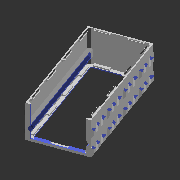
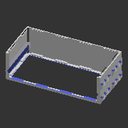
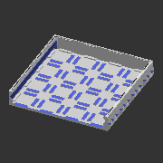

# A_DT*
* System: A
* Path: `models/A__system_A/DT__drawer_trays`
# Components
## A_DT221
* Unit count: (WxLxH) 2 x 2 x 1
* Component size: (WxLxH) 50 x 50 x 15 mm

| **A_DT221** | **A_DT221L** | 
| --- | --- | 
|  | Without floor | 
| STL: compile manually | STL: compile manually | 
|  |  | 

---
## A_DT222
* Unit count: (WxLxH) 2 x 2 x 2
* Component size: (WxLxH) 50 x 50 x 30 mm

| **A_DT222** | **A_DT222L** | 
| --- | --- | 
|  | Without floor | 
| STL: [drawers](https://github.com/CZDanol/DNLTray/releases/latest/download/DNLTray_A_drawers.zip) | STL: [drawers](https://github.com/CZDanol/DNLTray/releases/latest/download/DNLTray_A_drawers.zip) | 
|  |  | 

---
## A_DT241
* Unit count: (WxLxH) 2 x 4 x 1
* Component size: (WxLxH) 50 x 100 x 15 mm

| **A_DT241** | **A_DT241L** | 
| --- | --- | 
|  | Without floor | 
| STL: compile manually | STL: compile manually | 
|  |  | 

---
## A_DT242
* Unit count: (WxLxH) 2 x 4 x 2
* Component size: (WxLxH) 50 x 100 x 30 mm

| **A_DT242** | **A_DT242L** | 
| --- | --- | 
|  | Without floor | 
| STL: [drawers](https://github.com/CZDanol/DNLTray/releases/latest/download/DNLTray_A_drawers.zip) | STL: [drawers](https://github.com/CZDanol/DNLTray/releases/latest/download/DNLTray_A_drawers.zip) | 
|  |  | 

---
## A_DT261
* Unit count: (WxLxH) 2 x 6 x 1
* Component size: (WxLxH) 50 x 150 x 15 mm

| **A_DT261** | **A_DT261L** | 
| --- | --- | 
|  | Without floor | 
| STL: compile manually | STL: compile manually | 
|  |  | 

---
## A_DT262
* Unit count: (WxLxH) 2 x 6 x 2
* Component size: (WxLxH) 50 x 150 x 30 mm

| **A_DT262** | **A_DT262L** | 
| --- | --- | 
|  | Without floor | 
| STL: compile manually | STL: compile manually | 
|  |  | 

---
## A_DT321
* Unit count: (WxLxH) 3 x 2 x 1
* Component size: (WxLxH) 75 x 50 x 15 mm

| **A_DT321** | **A_DT321L** | 
| --- | --- | 
|  | Without floor | 
| STL: compile manually | STL: compile manually | 
|  |  | 

---
## A_DT322
* Unit count: (WxLxH) 3 x 2 x 2
* Component size: (WxLxH) 75 x 50 x 30 mm

| **A_DT322** | **A_DT322L** | 
| --- | --- | 
|  | Without floor | 
| STL: compile manually | STL: compile manually | 
|  |  | 

---
## A_DT341
* Unit count: (WxLxH) 3 x 4 x 1
* Component size: (WxLxH) 75 x 100 x 15 mm

| **A_DT341** | **A_DT341L** | 
| --- | --- | 
|  | Without floor | 
| STL: compile manually | STL: compile manually | 
|  |  | 

---
## A_DT342
* Unit count: (WxLxH) 3 x 4 x 2
* Component size: (WxLxH) 75 x 100 x 30 mm

| **A_DT342** | **A_DT342L** | 
| --- | --- | 
|  | Without floor | 
| STL: [drawers](https://github.com/CZDanol/DNLTray/releases/latest/download/DNLTray_A_drawers.zip) | STL: [drawers](https://github.com/CZDanol/DNLTray/releases/latest/download/DNLTray_A_drawers.zip) | 
|  |  | 

---
## A_DT361
* Unit count: (WxLxH) 3 x 6 x 1
* Component size: (WxLxH) 75 x 150 x 15 mm

| **A_DT361** | **A_DT361L** | 
| --- | --- | 
|  | Without floor | 
| STL: compile manually | STL: compile manually | 
|  |  | 

---
## A_DT362
* Unit count: (WxLxH) 3 x 6 x 2
* Component size: (WxLxH) 75 x 150 x 30 mm

| **A_DT362** | **A_DT362L** | 
| --- | --- | 
|  | Without floor | 
| STL: compile manually | STL: compile manually | 
|  |  | 

---
## A_DT421
* Unit count: (WxLxH) 4 x 2 x 1
* Component size: (WxLxH) 100 x 50 x 15 mm

| **A_DT421** | **A_DT421L** | 
| --- | --- | 
|  | Without floor | 
| STL: compile manually | STL: compile manually | 
|  |  | 

---
## A_DT422
* Unit count: (WxLxH) 4 x 2 x 2
* Component size: (WxLxH) 100 x 50 x 30 mm

| **A_DT422** | **A_DT422L** | 
| --- | --- | 
|  | Without floor | 
| STL: [drawers](https://github.com/CZDanol/DNLTray/releases/latest/download/DNLTray_A_drawers.zip) | STL: [drawers](https://github.com/CZDanol/DNLTray/releases/latest/download/DNLTray_A_drawers.zip) | 
|  |  | 

---
## A_DT424
* Unit count: (WxLxH) 4 x 2 x 4
* Component size: (WxLxH) 100 x 50 x 60 mm

| **A_DT424** | **A_DT424L** | 
| --- | --- | 
|  | Without floor | 
| STL: compile manually | STL: compile manually | 
|  |  | 

---
## A_DT441
* Unit count: (WxLxH) 4 x 4 x 1
* Component size: (WxLxH) 100 x 100 x 15 mm

| **A_DT441** | **A_DT441L** | 
| --- | --- | 
|  | Without floor | 
| STL: compile manually | STL: compile manually | 
|  |  | 

---
## A_DT442
* Unit count: (WxLxH) 4 x 4 x 2
* Component size: (WxLxH) 100 x 100 x 30 mm

| **A_DT442** | **A_DT442L** | 
| --- | --- | 
|  | Without floor | 
| STL: compile manually | STL: compile manually | 
|  |  | 

---
## A_DT444
* Unit count: (WxLxH) 4 x 4 x 4
* Component size: (WxLxH) 100 x 100 x 60 mm

| **A_DT444** | **A_DT444L** | 
| --- | --- | 
|  | Without floor | 
| STL: [drawers](https://github.com/CZDanol/DNLTray/releases/latest/download/DNLTray_A_drawers.zip) | STL: [drawers](https://github.com/CZDanol/DNLTray/releases/latest/download/DNLTray_A_drawers.zip) | 
|  |  | 

---
## A_DT461
* Unit count: (WxLxH) 4 x 6 x 1
* Component size: (WxLxH) 100 x 150 x 15 mm

| **A_DT461** | **A_DT461L** | 
| --- | --- | 
|  | Without floor | 
| STL: compile manually | STL: compile manually | 
|  |  | 

---
## A_DT462
* Unit count: (WxLxH) 4 x 6 x 2
* Component size: (WxLxH) 100 x 150 x 30 mm

| **A_DT462** | **A_DT462L** | 
| --- | --- | 
|  | Without floor | 
| STL: compile manually | STL: compile manually | 
|  |  | 

---
## A_DT464
* Unit count: (WxLxH) 4 x 6 x 4
* Component size: (WxLxH) 100 x 150 x 60 mm

| **A_DT464** | **A_DT464L** | 
| --- | --- | 
|  | Without floor | 
| STL: compile manually | STL: compile manually | 
|  |  | 

---
