# A_S*
* System: A
* Path: `models/A__system_A/S__shelves`
# Components
## A_S221
* Unit count: (WxLxH) 2 x 2 x 1
* Component size: (WxLxH) 50 x 50 x 15 mm

| **A_S221** | **A_S221R** | 
| --- | --- | 
|  | With rail | 
| STL: [shelves](https://github.com/CZDanol/DNLTray/releases/latest/download/DNLTray_A_shelves.zip) | STL: [shelves](https://github.com/CZDanol/DNLTray/releases/latest/download/DNLTray_A_shelves.zip) | 
|  |  | 

---
## A_S222
* Unit count: (WxLxH) 2 x 2 x 2
* Component size: (WxLxH) 50 x 50 x 30 mm

| **A_S222** | **A_S222R** | 
| --- | --- | 
|  | With rail | 
| STL: [shelves](https://github.com/CZDanol/DNLTray/releases/latest/download/DNLTray_A_shelves.zip) | STL: [shelves](https://github.com/CZDanol/DNLTray/releases/latest/download/DNLTray_A_shelves.zip) | 
|  | 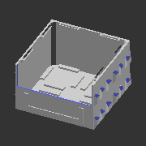 | 

---
## A_S223
* Unit count: (WxLxH) 2 x 2 x 3
* Component size: (WxLxH) 50 x 50 x 45 mm

| **A_S223** | **A_S223R** | 
| --- | --- | 
|  | With rail | 
| STL: compile manually | STL: compile manually | 
|  |  | 

---
## A_S224
* Unit count: (WxLxH) 2 x 2 x 4
* Component size: (WxLxH) 50 x 50 x 60 mm

| **A_S224** | **A_S224R** | 
| --- | --- | 
|  | With rail | 
| STL: [shelves](https://github.com/CZDanol/DNLTray/releases/latest/download/DNLTray_A_shelves.zip) | STL: [shelves](https://github.com/CZDanol/DNLTray/releases/latest/download/DNLTray_A_shelves.zip) | 
|  |  | 

---
## A_S226
* Unit count: (WxLxH) 2 x 2 x 6
* Component size: (WxLxH) 50 x 50 x 90 mm

| **A_S226** | **A_S226R** | 
| --- | --- | 
|  | With rail | 
| STL: [shelves](https://github.com/CZDanol/DNLTray/releases/latest/download/DNLTray_A_shelves.zip) | STL: [shelves](https://github.com/CZDanol/DNLTray/releases/latest/download/DNLTray_A_shelves.zip) | 
|  |  | 

---
## A_S228
* Unit count: (WxLxH) 2 x 2 x 8
* Component size: (WxLxH) 50 x 50 x 120 mm

| **A_S228** | **A_S228R** | 
| --- | --- | 
|  | With rail | 
| STL: [shelves](https://github.com/CZDanol/DNLTray/releases/latest/download/DNLTray_A_shelves.zip) | STL: [shelves](https://github.com/CZDanol/DNLTray/releases/latest/download/DNLTray_A_shelves.zip) | 
|  |  | 

---
## A_S231
* Unit count: (WxLxH) 2 x 3 x 1
* Component size: (WxLxH) 50 x 75 x 15 mm

| **A_S231** | **A_S231R** | 
| --- | --- | 
|  | With rail | 
| STL: compile manually | STL: compile manually | 
|  |  | 

---
## A_S232
* Unit count: (WxLxH) 2 x 3 x 2
* Component size: (WxLxH) 50 x 75 x 30 mm

| **A_S232** | **A_S232R** | 
| --- | --- | 
|  | With rail | 
| STL: compile manually | STL: compile manually | 
|  |  | 

---
## A_S233
* Unit count: (WxLxH) 2 x 3 x 3
* Component size: (WxLxH) 50 x 75 x 45 mm

| **A_S233** | **A_S233R** | 
| --- | --- | 
|  | With rail | 
| STL: compile manually | STL: compile manually | 
|  |  | 

---
## A_S234
* Unit count: (WxLxH) 2 x 3 x 4
* Component size: (WxLxH) 50 x 75 x 60 mm

| **A_S234** | **A_S234R** | 
| --- | --- | 
|  | With rail | 
| STL: compile manually | STL: compile manually | 
|  |  | 

---
## A_S236
* Unit count: (WxLxH) 2 x 3 x 6
* Component size: (WxLxH) 50 x 75 x 90 mm

| **A_S236** | **A_S236R** | 
| --- | --- | 
|  | With rail | 
| STL: compile manually | STL: compile manually | 
|  |  | 

---
## A_S238
* Unit count: (WxLxH) 2 x 3 x 8
* Component size: (WxLxH) 50 x 75 x 120 mm

| **A_S238** | **A_S238R** | 
| --- | --- | 
|  | With rail | 
| STL: compile manually | STL: compile manually | 
|  |  | 

---
## A_S241
* Unit count: (WxLxH) 2 x 4 x 1
* Component size: (WxLxH) 50 x 100 x 15 mm

| **A_S241** | **A_S241R** | 
| --- | --- | 
|  | With rail | 
| STL: compile manually | STL: compile manually | 
|  |  | 

---
## A_S242
* Unit count: (WxLxH) 2 x 4 x 2
* Component size: (WxLxH) 50 x 100 x 30 mm

| **A_S242** | **A_S242R** | 
| --- | --- | 
|  | With rail | 
| STL: compile manually | STL: compile manually | 
|  |  | 

---
## A_S243
* Unit count: (WxLxH) 2 x 4 x 3
* Component size: (WxLxH) 50 x 100 x 45 mm

| **A_S243** | **A_S243R** | 
| --- | --- | 
|  | With rail | 
| STL: compile manually | STL: compile manually | 
|  | 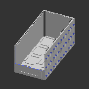 | 

---
## A_S244
* Unit count: (WxLxH) 2 x 4 x 4
* Component size: (WxLxH) 50 x 100 x 60 mm

| **A_S244** | **A_S244R** | 
| --- | --- | 
|  | With rail | 
| STL: compile manually | STL: compile manually | 
|  |  | 

---
## A_S246
* Unit count: (WxLxH) 2 x 4 x 6
* Component size: (WxLxH) 50 x 100 x 90 mm

| **A_S246** | **A_S246R** | 
| --- | --- | 
|  | With rail | 
| STL: compile manually | STL: compile manually | 
|  |  | 

---
## A_S248
* Unit count: (WxLxH) 2 x 4 x 8
* Component size: (WxLxH) 50 x 100 x 120 mm

| **A_S248** | **A_S248R** | 
| --- | --- | 
|  | With rail | 
| STL: compile manually | STL: compile manually | 
|  |  | 

---
## A_S261
* Unit count: (WxLxH) 2 x 6 x 1
* Component size: (WxLxH) 50 x 150 x 15 mm

| **A_S261** | **A_S261R** | 
| --- | --- | 
|  | With rail | 
| STL: compile manually | STL: compile manually | 
|  |  | 

---
## A_S262
* Unit count: (WxLxH) 2 x 6 x 2
* Component size: (WxLxH) 50 x 150 x 30 mm

| **A_S262** | **A_S262R** | 
| --- | --- | 
|  | With rail | 
| STL: compile manually | STL: compile manually | 
|  |  | 

---
## A_S263
* Unit count: (WxLxH) 2 x 6 x 3
* Component size: (WxLxH) 50 x 150 x 45 mm

| **A_S263** | **A_S263R** | 
| --- | --- | 
|  | With rail | 
| STL: compile manually | STL: compile manually | 
|  |  | 

---
## A_S264
* Unit count: (WxLxH) 2 x 6 x 4
* Component size: (WxLxH) 50 x 150 x 60 mm

| **A_S264** | **A_S264R** | 
| --- | --- | 
|  | With rail | 
| STL: compile manually | STL: compile manually | 
|  |  | 

---
## A_S266
* Unit count: (WxLxH) 2 x 6 x 6
* Component size: (WxLxH) 50 x 150 x 90 mm

| **A_S266** | **A_S266R** | 
| --- | --- | 
|  | With rail | 
| STL: compile manually | STL: compile manually | 
|  |  | 

---
## A_S268
* Unit count: (WxLxH) 2 x 6 x 8
* Component size: (WxLxH) 50 x 150 x 120 mm

| **A_S268** | **A_S268R** | 
| --- | --- | 
|  | With rail | 
| STL: compile manually | STL: compile manually | 
|  |  | 

---
## A_S281
* Unit count: (WxLxH) 2 x 8 x 1
* Component size: (WxLxH) 50 x 200 x 15 mm

| **A_S281** | **A_S281R** | 
| --- | --- | 
|  | With rail | 
| STL: compile manually | STL: compile manually | 
|  |  | 

---
## A_S282
* Unit count: (WxLxH) 2 x 8 x 2
* Component size: (WxLxH) 50 x 200 x 30 mm

| **A_S282** | **A_S282R** | 
| --- | --- | 
|  | With rail | 
| STL: compile manually | STL: compile manually | 
|  |  | 

---
## A_S283
* Unit count: (WxLxH) 2 x 8 x 3
* Component size: (WxLxH) 50 x 200 x 45 mm

| **A_S283** | **A_S283R** | 
| --- | --- | 
|  | With rail | 
| STL: compile manually | STL: compile manually | 
|  |  | 

---
## A_S284
* Unit count: (WxLxH) 2 x 8 x 4
* Component size: (WxLxH) 50 x 200 x 60 mm

| **A_S284** | **A_S284R** | 
| --- | --- | 
|  | With rail | 
| STL: compile manually | STL: compile manually | 
|  |  | 

---
## A_S286
* Unit count: (WxLxH) 2 x 8 x 6
* Component size: (WxLxH) 50 x 200 x 90 mm

| **A_S286** | **A_S286R** | 
| --- | --- | 
|  | With rail | 
| STL: compile manually | STL: compile manually | 
|  |  | 

---
## A_S288
* Unit count: (WxLxH) 2 x 8 x 8
* Component size: (WxLxH) 50 x 200 x 120 mm

| **A_S288** | **A_S288R** | 
| --- | --- | 
|  | With rail | 
| STL: compile manually | STL: compile manually | 
|  |  | 

---
## A_S321
* Unit count: (WxLxH) 3 x 2 x 1
* Component size: (WxLxH) 75 x 50 x 15 mm

| **A_S321** | **A_S321R** | 
| --- | --- | 
|  | With rail | 
| STL: compile manually | STL: compile manually | 
|  |  | 

---
## A_S322
* Unit count: (WxLxH) 3 x 2 x 2
* Component size: (WxLxH) 75 x 50 x 30 mm

| **A_S322** | **A_S322R** | 
| --- | --- | 
|  | With rail | 
| STL: compile manually | STL: compile manually | 
|  |  | 

---
## A_S323
* Unit count: (WxLxH) 3 x 2 x 3
* Component size: (WxLxH) 75 x 50 x 45 mm

| **A_S323** | **A_S323R** | 
| --- | --- | 
|  | With rail | 
| STL: compile manually | STL: compile manually | 
|  |  | 

---
## A_S324
* Unit count: (WxLxH) 3 x 2 x 4
* Component size: (WxLxH) 75 x 50 x 60 mm

| **A_S324** | **A_S324R** | 
| --- | --- | 
|  | With rail | 
| STL: compile manually | STL: compile manually | 
|  |  | 

---
## A_S326
* Unit count: (WxLxH) 3 x 2 x 6
* Component size: (WxLxH) 75 x 50 x 90 mm

| **A_S326** | **A_S326R** | 
| --- | --- | 
|  | With rail | 
| STL: compile manually | STL: compile manually | 
|  |  | 

---
## A_S328
* Unit count: (WxLxH) 3 x 2 x 8
* Component size: (WxLxH) 75 x 50 x 120 mm

| **A_S328** | **A_S328R** | 
| --- | --- | 
|  | With rail | 
| STL: compile manually | STL: compile manually | 
|  |  | 

---
## A_S331
* Unit count: (WxLxH) 3 x 3 x 1
* Component size: (WxLxH) 75 x 75 x 15 mm

| **A_S331** | **A_S331R** | 
| --- | --- | 
|  | With rail | 
| STL: [shelves](https://github.com/CZDanol/DNLTray/releases/latest/download/DNLTray_A_shelves.zip) | STL: [shelves](https://github.com/CZDanol/DNLTray/releases/latest/download/DNLTray_A_shelves.zip) | 
|  |  | 

---
## A_S332
* Unit count: (WxLxH) 3 x 3 x 2
* Component size: (WxLxH) 75 x 75 x 30 mm

| **A_S332** | **A_S332R** | 
| --- | --- | 
|  | With rail | 
| STL: [shelves](https://github.com/CZDanol/DNLTray/releases/latest/download/DNLTray_A_shelves.zip) | STL: [shelves](https://github.com/CZDanol/DNLTray/releases/latest/download/DNLTray_A_shelves.zip) | 
|  |  | 

---
## A_S333
* Unit count: (WxLxH) 3 x 3 x 3
* Component size: (WxLxH) 75 x 75 x 45 mm

| **A_S333** | **A_S333R** | 
| --- | --- | 
|  | With rail | 
| STL: compile manually | STL: compile manually | 
|  |  | 

---
## A_S334
* Unit count: (WxLxH) 3 x 3 x 4
* Component size: (WxLxH) 75 x 75 x 60 mm

| **A_S334** | **A_S334R** | 
| --- | --- | 
|  | With rail | 
| STL: [shelves](https://github.com/CZDanol/DNLTray/releases/latest/download/DNLTray_A_shelves.zip) | STL: [shelves](https://github.com/CZDanol/DNLTray/releases/latest/download/DNLTray_A_shelves.zip) | 
|  |  | 

---
## A_S336
* Unit count: (WxLxH) 3 x 3 x 6
* Component size: (WxLxH) 75 x 75 x 90 mm

| **A_S336** | **A_S336R** | 
| --- | --- | 
|  | With rail | 
| STL: [shelves](https://github.com/CZDanol/DNLTray/releases/latest/download/DNLTray_A_shelves.zip) | STL: [shelves](https://github.com/CZDanol/DNLTray/releases/latest/download/DNLTray_A_shelves.zip) | 
|  |  | 

---
## A_S338
* Unit count: (WxLxH) 3 x 3 x 8
* Component size: (WxLxH) 75 x 75 x 120 mm

| **A_S338** | **A_S338R** | 
| --- | --- | 
|  | With rail | 
| STL: [shelves](https://github.com/CZDanol/DNLTray/releases/latest/download/DNLTray_A_shelves.zip) | STL: [shelves](https://github.com/CZDanol/DNLTray/releases/latest/download/DNLTray_A_shelves.zip) | 
|  | 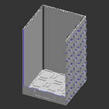 | 

---
## A_S341
* Unit count: (WxLxH) 3 x 4 x 1
* Component size: (WxLxH) 75 x 100 x 15 mm

| **A_S341** | **A_S341R** | 
| --- | --- | 
|  | With rail | 
| STL: compile manually | STL: compile manually | 
|  |  | 

---
## A_S342
* Unit count: (WxLxH) 3 x 4 x 2
* Component size: (WxLxH) 75 x 100 x 30 mm

| **A_S342** | **A_S342R** | 
| --- | --- | 
|  | With rail | 
| STL: compile manually | STL: compile manually | 
|  | 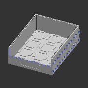 | 

---
## A_S343
* Unit count: (WxLxH) 3 x 4 x 3
* Component size: (WxLxH) 75 x 100 x 45 mm

| **A_S343** | **A_S343R** | 
| --- | --- | 
|  | With rail | 
| STL: compile manually | STL: compile manually | 
| 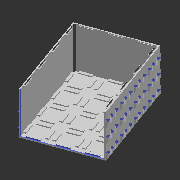 |  | 

---
## A_S344
* Unit count: (WxLxH) 3 x 4 x 4
* Component size: (WxLxH) 75 x 100 x 60 mm

| **A_S344** | **A_S344R** | 
| --- | --- | 
|  | With rail | 
| STL: compile manually | STL: compile manually | 
|  |  | 

---
## A_S346
* Unit count: (WxLxH) 3 x 4 x 6
* Component size: (WxLxH) 75 x 100 x 90 mm

| **A_S346** | **A_S346R** | 
| --- | --- | 
|  | With rail | 
| STL: compile manually | STL: compile manually | 
|  |  | 

---
## A_S348
* Unit count: (WxLxH) 3 x 4 x 8
* Component size: (WxLxH) 75 x 100 x 120 mm

| **A_S348** | **A_S348R** | 
| --- | --- | 
|  | With rail | 
| STL: compile manually | STL: compile manually | 
|  |  | 

---
## A_S361
* Unit count: (WxLxH) 3 x 6 x 1
* Component size: (WxLxH) 75 x 150 x 15 mm

| **A_S361** | **A_S361R** | 
| --- | --- | 
|  | With rail | 
| STL: compile manually | STL: compile manually | 
| 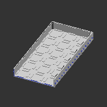 |  | 

---
## A_S362
* Unit count: (WxLxH) 3 x 6 x 2
* Component size: (WxLxH) 75 x 150 x 30 mm

| **A_S362** | **A_S362R** | 
| --- | --- | 
|  | With rail | 
| STL: compile manually | STL: compile manually | 
|  |  | 

---
## A_S363
* Unit count: (WxLxH) 3 x 6 x 3
* Component size: (WxLxH) 75 x 150 x 45 mm

| **A_S363** | **A_S363R** | 
| --- | --- | 
|  | With rail | 
| STL: compile manually | STL: compile manually | 
|  |  | 

---
## A_S364
* Unit count: (WxLxH) 3 x 6 x 4
* Component size: (WxLxH) 75 x 150 x 60 mm

| **A_S364** | **A_S364R** | 
| --- | --- | 
|  | With rail | 
| STL: compile manually | STL: compile manually | 
|  |  | 

---
## A_S366
* Unit count: (WxLxH) 3 x 6 x 6
* Component size: (WxLxH) 75 x 150 x 90 mm

| **A_S366** | **A_S366R** | 
| --- | --- | 
|  | With rail | 
| STL: compile manually | STL: compile manually | 
|  |  | 

---
## A_S368
* Unit count: (WxLxH) 3 x 6 x 8
* Component size: (WxLxH) 75 x 150 x 120 mm

| **A_S368** | **A_S368R** | 
| --- | --- | 
|  | With rail | 
| STL: compile manually | STL: compile manually | 
|  |  | 

---
## A_S381
* Unit count: (WxLxH) 3 x 8 x 1
* Component size: (WxLxH) 75 x 200 x 15 mm

| **A_S381** | **A_S381R** | 
| --- | --- | 
|  | With rail | 
| STL: compile manually | STL: compile manually | 
|  | 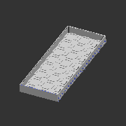 | 

---
## A_S382
* Unit count: (WxLxH) 3 x 8 x 2
* Component size: (WxLxH) 75 x 200 x 30 mm

| **A_S382** | **A_S382R** | 
| --- | --- | 
|  | With rail | 
| STL: compile manually | STL: compile manually | 
|  | 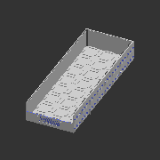 | 

---
## A_S383
* Unit count: (WxLxH) 3 x 8 x 3
* Component size: (WxLxH) 75 x 200 x 45 mm

| **A_S383** | **A_S383R** | 
| --- | --- | 
|  | With rail | 
| STL: compile manually | STL: compile manually | 
|  |  | 

---
## A_S384
* Unit count: (WxLxH) 3 x 8 x 4
* Component size: (WxLxH) 75 x 200 x 60 mm

| **A_S384** | **A_S384R** | 
| --- | --- | 
|  | With rail | 
| STL: compile manually | STL: compile manually | 
|  |  | 

---
## A_S386
* Unit count: (WxLxH) 3 x 8 x 6
* Component size: (WxLxH) 75 x 200 x 90 mm

| **A_S386** | **A_S386R** | 
| --- | --- | 
|  | With rail | 
| STL: compile manually | STL: compile manually | 
|  |  | 

---
## A_S388
* Unit count: (WxLxH) 3 x 8 x 8
* Component size: (WxLxH) 75 x 200 x 120 mm

| **A_S388** | **A_S388R** | 
| --- | --- | 
|  | With rail | 
| STL: compile manually | STL: compile manually | 
|  |  | 

---
## A_S421
* Unit count: (WxLxH) 4 x 2 x 1
* Component size: (WxLxH) 100 x 50 x 15 mm

| **A_S421** | **A_S421R** | 
| --- | --- | 
|  | With rail | 
| STL: [shelves](https://github.com/CZDanol/DNLTray/releases/latest/download/DNLTray_A_shelves.zip) | STL: [shelves](https://github.com/CZDanol/DNLTray/releases/latest/download/DNLTray_A_shelves.zip) | 
|  |  | 

---
## A_S422
* Unit count: (WxLxH) 4 x 2 x 2
* Component size: (WxLxH) 100 x 50 x 30 mm

| **A_S422** | **A_S422R** | 
| --- | --- | 
|  | With rail | 
| STL: [shelves](https://github.com/CZDanol/DNLTray/releases/latest/download/DNLTray_A_shelves.zip) | STL: [shelves](https://github.com/CZDanol/DNLTray/releases/latest/download/DNLTray_A_shelves.zip) | 
|  |  | 

---
## A_S423
* Unit count: (WxLxH) 4 x 2 x 3
* Component size: (WxLxH) 100 x 50 x 45 mm

| **A_S423** | **A_S423R** | 
| --- | --- | 
|  | With rail | 
| STL: compile manually | STL: compile manually | 
|  |  | 

---
## A_S424
* Unit count: (WxLxH) 4 x 2 x 4
* Component size: (WxLxH) 100 x 50 x 60 mm

| **A_S424** | **A_S424R** | 
| --- | --- | 
|  | With rail | 
| STL: [shelves](https://github.com/CZDanol/DNLTray/releases/latest/download/DNLTray_A_shelves.zip) | STL: [shelves](https://github.com/CZDanol/DNLTray/releases/latest/download/DNLTray_A_shelves.zip) | 
|  |  | 

---
## A_S426
* Unit count: (WxLxH) 4 x 2 x 6
* Component size: (WxLxH) 100 x 50 x 90 mm

| **A_S426** | **A_S426R** | 
| --- | --- | 
|  | With rail | 
| STL: [shelves](https://github.com/CZDanol/DNLTray/releases/latest/download/DNLTray_A_shelves.zip) | STL: [shelves](https://github.com/CZDanol/DNLTray/releases/latest/download/DNLTray_A_shelves.zip) | 
|  |  | 

---
## A_S428
* Unit count: (WxLxH) 4 x 2 x 8
* Component size: (WxLxH) 100 x 50 x 120 mm

| **A_S428** | **A_S428R** | 
| --- | --- | 
|  | With rail | 
| STL: [shelves](https://github.com/CZDanol/DNLTray/releases/latest/download/DNLTray_A_shelves.zip) | STL: [shelves](https://github.com/CZDanol/DNLTray/releases/latest/download/DNLTray_A_shelves.zip) | 
|  |  | 

---
## A_S431
* Unit count: (WxLxH) 4 x 3 x 1
* Component size: (WxLxH) 100 x 75 x 15 mm

| **A_S431** | **A_S431R** | 
| --- | --- | 
|  | With rail | 
| STL: compile manually | STL: compile manually | 
|  |  | 

---
## A_S432
* Unit count: (WxLxH) 4 x 3 x 2
* Component size: (WxLxH) 100 x 75 x 30 mm

| **A_S432** | **A_S432R** | 
| --- | --- | 
|  | With rail | 
| STL: compile manually | STL: compile manually | 
|  |  | 

---
## A_S433
* Unit count: (WxLxH) 4 x 3 x 3
* Component size: (WxLxH) 100 x 75 x 45 mm

| **A_S433** | **A_S433R** | 
| --- | --- | 
|  | With rail | 
| STL: compile manually | STL: compile manually | 
|  |  | 

---
## A_S434
* Unit count: (WxLxH) 4 x 3 x 4
* Component size: (WxLxH) 100 x 75 x 60 mm

| **A_S434** | **A_S434R** | 
| --- | --- | 
|  | With rail | 
| STL: compile manually | STL: compile manually | 
|  |  | 

---
## A_S436
* Unit count: (WxLxH) 4 x 3 x 6
* Component size: (WxLxH) 100 x 75 x 90 mm

| **A_S436** | **A_S436R** | 
| --- | --- | 
|  | With rail | 
| STL: compile manually | STL: compile manually | 
|  |  | 

---
## A_S438
* Unit count: (WxLxH) 4 x 3 x 8
* Component size: (WxLxH) 100 x 75 x 120 mm

| **A_S438** | **A_S438R** | 
| --- | --- | 
|  | With rail | 
| STL: compile manually | STL: compile manually | 
|  | 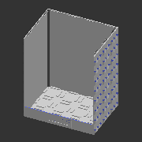 | 

---
## A_S441
* Unit count: (WxLxH) 4 x 4 x 1
* Component size: (WxLxH) 100 x 100 x 15 mm

| **A_S441** | **A_S441R** | 
| --- | --- | 
|  | With rail | 
| STL: [shelves](https://github.com/CZDanol/DNLTray/releases/latest/download/DNLTray_A_shelves.zip) | STL: [shelves](https://github.com/CZDanol/DNLTray/releases/latest/download/DNLTray_A_shelves.zip) | 
|  |  | 

---
## A_S442
* Unit count: (WxLxH) 4 x 4 x 2
* Component size: (WxLxH) 100 x 100 x 30 mm

| **A_S442** | **A_S442R** | 
| --- | --- | 
|  | With rail | 
| STL: [shelves](https://github.com/CZDanol/DNLTray/releases/latest/download/DNLTray_A_shelves.zip) | STL: [shelves](https://github.com/CZDanol/DNLTray/releases/latest/download/DNLTray_A_shelves.zip) | 
|  |  | 

---
## A_S443
* Unit count: (WxLxH) 4 x 4 x 3
* Component size: (WxLxH) 100 x 100 x 45 mm

| **A_S443** | **A_S443R** | 
| --- | --- | 
|  | With rail | 
| STL: compile manually | STL: compile manually | 
|  |  | 

---
## A_S444
* Unit count: (WxLxH) 4 x 4 x 4
* Component size: (WxLxH) 100 x 100 x 60 mm

| **A_S444** | **A_S444R** | 
| --- | --- | 
|  | With rail | 
| STL: [shelves](https://github.com/CZDanol/DNLTray/releases/latest/download/DNLTray_A_shelves.zip) | STL: [shelves](https://github.com/CZDanol/DNLTray/releases/latest/download/DNLTray_A_shelves.zip) | 
|  |  | 

---
## A_S446
* Unit count: (WxLxH) 4 x 4 x 6
* Component size: (WxLxH) 100 x 100 x 90 mm

| **A_S446** | **A_S446R** | 
| --- | --- | 
|  | With rail | 
| STL: [shelves](https://github.com/CZDanol/DNLTray/releases/latest/download/DNLTray_A_shelves.zip) | STL: [shelves](https://github.com/CZDanol/DNLTray/releases/latest/download/DNLTray_A_shelves.zip) | 
|  |  | 

---
## A_S448
* Unit count: (WxLxH) 4 x 4 x 8
* Component size: (WxLxH) 100 x 100 x 120 mm

| **A_S448** | **A_S448R** | 
| --- | --- | 
|  | With rail | 
| STL: [shelves](https://github.com/CZDanol/DNLTray/releases/latest/download/DNLTray_A_shelves.zip) | STL: [shelves](https://github.com/CZDanol/DNLTray/releases/latest/download/DNLTray_A_shelves.zip) | 
|  |  | 

---
## A_S461
* Unit count: (WxLxH) 4 x 6 x 1
* Component size: (WxLxH) 100 x 150 x 15 mm

| **A_S461** | **A_S461R** | 
| --- | --- | 
|  | With rail | 
| STL: compile manually | STL: compile manually | 
|  |  | 

---
## A_S462
* Unit count: (WxLxH) 4 x 6 x 2
* Component size: (WxLxH) 100 x 150 x 30 mm

| **A_S462** | **A_S462R** | 
| --- | --- | 
|  | With rail | 
| STL: compile manually | STL: compile manually | 
|  |  | 

---
## A_S463
* Unit count: (WxLxH) 4 x 6 x 3
* Component size: (WxLxH) 100 x 150 x 45 mm

| **A_S463** | **A_S463R** | 
| --- | --- | 
|  | With rail | 
| STL: compile manually | STL: compile manually | 
|  |  | 

---
## A_S464
* Unit count: (WxLxH) 4 x 6 x 4
* Component size: (WxLxH) 100 x 150 x 60 mm

| **A_S464** | **A_S464R** | 
| --- | --- | 
|  | With rail | 
| STL: compile manually | STL: compile manually | 
|  |  | 

---
## A_S466
* Unit count: (WxLxH) 4 x 6 x 6
* Component size: (WxLxH) 100 x 150 x 90 mm

| **A_S466** | **A_S466R** | 
| --- | --- | 
|  | With rail | 
| STL: compile manually | STL: compile manually | 
|  |  | 

---
## A_S468
* Unit count: (WxLxH) 4 x 6 x 8
* Component size: (WxLxH) 100 x 150 x 120 mm

| **A_S468** | **A_S468R** | 
| --- | --- | 
|  | With rail | 
| STL: compile manually | STL: compile manually | 
|  |  | 

---
## A_S481
* Unit count: (WxLxH) 4 x 8 x 1
* Component size: (WxLxH) 100 x 200 x 15 mm

| **A_S481** | **A_S481R** | 
| --- | --- | 
|  | With rail | 
| STL: compile manually | STL: compile manually | 
|  | 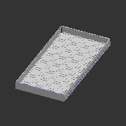 | 

---
## A_S482
* Unit count: (WxLxH) 4 x 8 x 2
* Component size: (WxLxH) 100 x 200 x 30 mm

| **A_S482** | **A_S482R** | 
| --- | --- | 
|  | With rail | 
| STL: compile manually | STL: compile manually | 
|  |  | 

---
## A_S483
* Unit count: (WxLxH) 4 x 8 x 3
* Component size: (WxLxH) 100 x 200 x 45 mm

| **A_S483** | **A_S483R** | 
| --- | --- | 
|  | With rail | 
| STL: compile manually | STL: compile manually | 
|  |  | 

---
## A_S484
* Unit count: (WxLxH) 4 x 8 x 4
* Component size: (WxLxH) 100 x 200 x 60 mm

| **A_S484** | **A_S484R** | 
| --- | --- | 
|  | With rail | 
| STL: compile manually | STL: compile manually | 
|  |  | 

---
## A_S486
* Unit count: (WxLxH) 4 x 8 x 6
* Component size: (WxLxH) 100 x 200 x 90 mm

| **A_S486** | **A_S486R** | 
| --- | --- | 
|  | With rail | 
| STL: compile manually | STL: compile manually | 
|  |  | 

---
## A_S488
* Unit count: (WxLxH) 4 x 8 x 8
* Component size: (WxLxH) 100 x 200 x 120 mm

| **A_S488** | **A_S488R** | 
| --- | --- | 
|  | With rail | 
| STL: compile manually | STL: compile manually | 
|  |  | 

---
## A_S621
* Unit count: (WxLxH) 6 x 2 x 1
* Component size: (WxLxH) 150 x 50 x 15 mm

| **A_S621** | **A_S621R** | 
| --- | --- | 
|  | With rail | 
| STL: [shelves](https://github.com/CZDanol/DNLTray/releases/latest/download/DNLTray_A_shelves.zip) | STL: [shelves](https://github.com/CZDanol/DNLTray/releases/latest/download/DNLTray_A_shelves.zip) | 
|  |  | 

---
## A_S622
* Unit count: (WxLxH) 6 x 2 x 2
* Component size: (WxLxH) 150 x 50 x 30 mm

| **A_S622** | **A_S622R** | 
| --- | --- | 
|  | With rail | 
| STL: [shelves](https://github.com/CZDanol/DNLTray/releases/latest/download/DNLTray_A_shelves.zip) | STL: [shelves](https://github.com/CZDanol/DNLTray/releases/latest/download/DNLTray_A_shelves.zip) | 
|  |  | 

---
## A_S623
* Unit count: (WxLxH) 6 x 2 x 3
* Component size: (WxLxH) 150 x 50 x 45 mm

| **A_S623** | **A_S623R** | 
| --- | --- | 
|  | With rail | 
| STL: compile manually | STL: compile manually | 
|  |  | 

---
## A_S624
* Unit count: (WxLxH) 6 x 2 x 4
* Component size: (WxLxH) 150 x 50 x 60 mm

| **A_S624** | **A_S624R** | 
| --- | --- | 
|  | With rail | 
| STL: [shelves](https://github.com/CZDanol/DNLTray/releases/latest/download/DNLTray_A_shelves.zip) | STL: [shelves](https://github.com/CZDanol/DNLTray/releases/latest/download/DNLTray_A_shelves.zip) | 
|  |  | 

---
## A_S626
* Unit count: (WxLxH) 6 x 2 x 6
* Component size: (WxLxH) 150 x 50 x 90 mm

| **A_S626** | **A_S626R** | 
| --- | --- | 
|  | With rail | 
| STL: [shelves](https://github.com/CZDanol/DNLTray/releases/latest/download/DNLTray_A_shelves.zip) | STL: [shelves](https://github.com/CZDanol/DNLTray/releases/latest/download/DNLTray_A_shelves.zip) | 
| 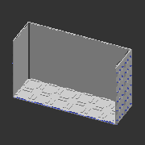 |  | 

---
## A_S628
* Unit count: (WxLxH) 6 x 2 x 8
* Component size: (WxLxH) 150 x 50 x 120 mm

| **A_S628** | **A_S628R** | 
| --- | --- | 
|  | With rail | 
| STL: [shelves](https://github.com/CZDanol/DNLTray/releases/latest/download/DNLTray_A_shelves.zip) | STL: [shelves](https://github.com/CZDanol/DNLTray/releases/latest/download/DNLTray_A_shelves.zip) | 
|  |  | 

---
## A_S631
* Unit count: (WxLxH) 6 x 3 x 1
* Component size: (WxLxH) 150 x 75 x 15 mm

| **A_S631** | **A_S631R** | 
| --- | --- | 
|  | With rail | 
| STL: compile manually | STL: compile manually | 
|  |  | 

---
## A_S632
* Unit count: (WxLxH) 6 x 3 x 2
* Component size: (WxLxH) 150 x 75 x 30 mm

| **A_S632** | **A_S632R** | 
| --- | --- | 
|  | With rail | 
| STL: compile manually | STL: compile manually | 
|  |  | 

---
## A_S633
* Unit count: (WxLxH) 6 x 3 x 3
* Component size: (WxLxH) 150 x 75 x 45 mm

| **A_S633** | **A_S633R** | 
| --- | --- | 
|  | With rail | 
| STL: compile manually | STL: compile manually | 
|  |  | 

---
## A_S634
* Unit count: (WxLxH) 6 x 3 x 4
* Component size: (WxLxH) 150 x 75 x 60 mm

| **A_S634** | **A_S634R** | 
| --- | --- | 
|  | With rail | 
| STL: compile manually | STL: compile manually | 
|  |  | 

---
## A_S636
* Unit count: (WxLxH) 6 x 3 x 6
* Component size: (WxLxH) 150 x 75 x 90 mm

| **A_S636** | **A_S636R** | 
| --- | --- | 
|  | With rail | 
| STL: compile manually | STL: compile manually | 
|  |  | 

---
## A_S638
* Unit count: (WxLxH) 6 x 3 x 8
* Component size: (WxLxH) 150 x 75 x 120 mm

| **A_S638** | **A_S638R** | 
| --- | --- | 
|  | With rail | 
| STL: compile manually | STL: compile manually | 
|  |  | 

---
## A_S641
* Unit count: (WxLxH) 6 x 4 x 1
* Component size: (WxLxH) 150 x 100 x 15 mm

| **A_S641** | **A_S641R** | 
| --- | --- | 
|  | With rail | 
| STL: [shelves](https://github.com/CZDanol/DNLTray/releases/latest/download/DNLTray_A_shelves.zip) | STL: [shelves](https://github.com/CZDanol/DNLTray/releases/latest/download/DNLTray_A_shelves.zip) | 
|  |  | 

---
## A_S642
* Unit count: (WxLxH) 6 x 4 x 2
* Component size: (WxLxH) 150 x 100 x 30 mm

| **A_S642** | **A_S642R** | 
| --- | --- | 
|  | With rail | 
| STL: [shelves](https://github.com/CZDanol/DNLTray/releases/latest/download/DNLTray_A_shelves.zip) | STL: [shelves](https://github.com/CZDanol/DNLTray/releases/latest/download/DNLTray_A_shelves.zip) | 
|  |  | 

---
## A_S643
* Unit count: (WxLxH) 6 x 4 x 3
* Component size: (WxLxH) 150 x 100 x 45 mm

| **A_S643** | **A_S643R** | 
| --- | --- | 
|  | With rail | 
| STL: compile manually | STL: compile manually | 
|  |  | 

---
## A_S644
* Unit count: (WxLxH) 6 x 4 x 4
* Component size: (WxLxH) 150 x 100 x 60 mm

| **A_S644** | **A_S644R** | 
| --- | --- | 
|  | With rail | 
| STL: [shelves](https://github.com/CZDanol/DNLTray/releases/latest/download/DNLTray_A_shelves.zip) | STL: [shelves](https://github.com/CZDanol/DNLTray/releases/latest/download/DNLTray_A_shelves.zip) | 
|  |  | 

---
## A_S646
* Unit count: (WxLxH) 6 x 4 x 6
* Component size: (WxLxH) 150 x 100 x 90 mm

| **A_S646** | **A_S646R** | 
| --- | --- | 
|  | With rail | 
| STL: [shelves](https://github.com/CZDanol/DNLTray/releases/latest/download/DNLTray_A_shelves.zip) | STL: [shelves](https://github.com/CZDanol/DNLTray/releases/latest/download/DNLTray_A_shelves.zip) | 
|  | 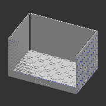 | 

---
## A_S648
* Unit count: (WxLxH) 6 x 4 x 8
* Component size: (WxLxH) 150 x 100 x 120 mm

| **A_S648** | **A_S648R** | 
| --- | --- | 
|  | With rail | 
| STL: [shelves](https://github.com/CZDanol/DNLTray/releases/latest/download/DNLTray_A_shelves.zip) | STL: [shelves](https://github.com/CZDanol/DNLTray/releases/latest/download/DNLTray_A_shelves.zip) | 
|  |  | 

---
## A_S661
* Unit count: (WxLxH) 6 x 6 x 1
* Component size: (WxLxH) 150 x 150 x 15 mm

| **A_S661** | **A_S661R** | 
| --- | --- | 
|  | With rail | 
| STL: [shelves](https://github.com/CZDanol/DNLTray/releases/latest/download/DNLTray_A_shelves.zip) | STL: [shelves](https://github.com/CZDanol/DNLTray/releases/latest/download/DNLTray_A_shelves.zip) | 
|  |  | 

---
## A_S662
* Unit count: (WxLxH) 6 x 6 x 2
* Component size: (WxLxH) 150 x 150 x 30 mm

| **A_S662** | **A_S662R** | 
| --- | --- | 
|  | With rail | 
| STL: [shelves](https://github.com/CZDanol/DNLTray/releases/latest/download/DNLTray_A_shelves.zip) | STL: [shelves](https://github.com/CZDanol/DNLTray/releases/latest/download/DNLTray_A_shelves.zip) | 
|  |  | 

---
## A_S663
* Unit count: (WxLxH) 6 x 6 x 3
* Component size: (WxLxH) 150 x 150 x 45 mm

| **A_S663** | **A_S663R** | 
| --- | --- | 
|  | With rail | 
| STL: compile manually | STL: compile manually | 
|  |  | 

---
## A_S664
* Unit count: (WxLxH) 6 x 6 x 4
* Component size: (WxLxH) 150 x 150 x 60 mm

| **A_S664** | **A_S664R** | 
| --- | --- | 
|  | With rail | 
| STL: [shelves](https://github.com/CZDanol/DNLTray/releases/latest/download/DNLTray_A_shelves.zip) | STL: [shelves](https://github.com/CZDanol/DNLTray/releases/latest/download/DNLTray_A_shelves.zip) | 
|  |  | 

---
## A_S666
* Unit count: (WxLxH) 6 x 6 x 6
* Component size: (WxLxH) 150 x 150 x 90 mm

| **A_S666** | **A_S666R** | 
| --- | --- | 
|  | With rail | 
| STL: [shelves](https://github.com/CZDanol/DNLTray/releases/latest/download/DNLTray_A_shelves.zip) | STL: [shelves](https://github.com/CZDanol/DNLTray/releases/latest/download/DNLTray_A_shelves.zip) | 
|  |  | 

---
## A_S668
* Unit count: (WxLxH) 6 x 6 x 8
* Component size: (WxLxH) 150 x 150 x 120 mm

| **A_S668** | **A_S668R** | 
| --- | --- | 
|  | With rail | 
| STL: [shelves](https://github.com/CZDanol/DNLTray/releases/latest/download/DNLTray_A_shelves.zip) | STL: [shelves](https://github.com/CZDanol/DNLTray/releases/latest/download/DNLTray_A_shelves.zip) | 
|  |  | 

---
## A_S681
* Unit count: (WxLxH) 6 x 8 x 1
* Component size: (WxLxH) 150 x 200 x 15 mm

| **A_S681** | **A_S681R** | 
| --- | --- | 
|  | With rail | 
| STL: compile manually | STL: compile manually | 
|  |  | 

---
## A_S682
* Unit count: (WxLxH) 6 x 8 x 2
* Component size: (WxLxH) 150 x 200 x 30 mm

| **A_S682** | **A_S682R** | 
| --- | --- | 
|  | With rail | 
| STL: compile manually | STL: compile manually | 
|  |  | 

---
## A_S683
* Unit count: (WxLxH) 6 x 8 x 3
* Component size: (WxLxH) 150 x 200 x 45 mm

| **A_S683** | **A_S683R** | 
| --- | --- | 
|  | With rail | 
| STL: compile manually | STL: compile manually | 
|  |  | 

---
## A_S684
* Unit count: (WxLxH) 6 x 8 x 4
* Component size: (WxLxH) 150 x 200 x 60 mm

| **A_S684** | **A_S684R** | 
| --- | --- | 
|  | With rail | 
| STL: compile manually | STL: compile manually | 
|  |  | 

---
## A_S686
* Unit count: (WxLxH) 6 x 8 x 6
* Component size: (WxLxH) 150 x 200 x 90 mm

| **A_S686** | **A_S686R** | 
| --- | --- | 
|  | With rail | 
| STL: compile manually | STL: compile manually | 
|  |  | 

---
## A_S688
* Unit count: (WxLxH) 6 x 8 x 8
* Component size: (WxLxH) 150 x 200 x 120 mm

| **A_S688** | **A_S688R** | 
| --- | --- | 
|  | With rail | 
| STL: compile manually | STL: compile manually | 
|  |  | 

---
## A_S821
* Unit count: (WxLxH) 8 x 2 x 1
* Component size: (WxLxH) 200 x 50 x 15 mm

| **A_S821** | **A_S821R** | 
| --- | --- | 
|  | With rail | 
| STL: [shelves](https://github.com/CZDanol/DNLTray/releases/latest/download/DNLTray_A_shelves.zip) | STL: [shelves](https://github.com/CZDanol/DNLTray/releases/latest/download/DNLTray_A_shelves.zip) | 
|  |  | 

---
## A_S822
* Unit count: (WxLxH) 8 x 2 x 2
* Component size: (WxLxH) 200 x 50 x 30 mm

| **A_S822** | **A_S822R** | 
| --- | --- | 
|  | With rail | 
| STL: [shelves](https://github.com/CZDanol/DNLTray/releases/latest/download/DNLTray_A_shelves.zip) | STL: [shelves](https://github.com/CZDanol/DNLTray/releases/latest/download/DNLTray_A_shelves.zip) | 
|  |  | 

---
## A_S823
* Unit count: (WxLxH) 8 x 2 x 3
* Component size: (WxLxH) 200 x 50 x 45 mm

| **A_S823** | **A_S823R** | 
| --- | --- | 
|  | With rail | 
| STL: compile manually | STL: compile manually | 
|  |  | 

---
## A_S824
* Unit count: (WxLxH) 8 x 2 x 4
* Component size: (WxLxH) 200 x 50 x 60 mm

| **A_S824** | **A_S824R** | 
| --- | --- | 
|  | With rail | 
| STL: [shelves](https://github.com/CZDanol/DNLTray/releases/latest/download/DNLTray_A_shelves.zip) | STL: [shelves](https://github.com/CZDanol/DNLTray/releases/latest/download/DNLTray_A_shelves.zip) | 
|  |  | 

---
## A_S826
* Unit count: (WxLxH) 8 x 2 x 6
* Component size: (WxLxH) 200 x 50 x 90 mm

| **A_S826** | **A_S826R** | 
| --- | --- | 
|  | With rail | 
| STL: [shelves](https://github.com/CZDanol/DNLTray/releases/latest/download/DNLTray_A_shelves.zip) | STL: [shelves](https://github.com/CZDanol/DNLTray/releases/latest/download/DNLTray_A_shelves.zip) | 
|  |  | 

---
## A_S828
* Unit count: (WxLxH) 8 x 2 x 8
* Component size: (WxLxH) 200 x 50 x 120 mm

| **A_S828** | **A_S828R** | 
| --- | --- | 
|  | With rail | 
| STL: [shelves](https://github.com/CZDanol/DNLTray/releases/latest/download/DNLTray_A_shelves.zip) | STL: [shelves](https://github.com/CZDanol/DNLTray/releases/latest/download/DNLTray_A_shelves.zip) | 
|  |  | 

---
## A_S831
* Unit count: (WxLxH) 8 x 3 x 1
* Component size: (WxLxH) 200 x 75 x 15 mm

| **A_S831** | **A_S831R** | 
| --- | --- | 
|  | With rail | 
| STL: compile manually | STL: compile manually | 
|  |  | 

---
## A_S832
* Unit count: (WxLxH) 8 x 3 x 2
* Component size: (WxLxH) 200 x 75 x 30 mm

| **A_S832** | **A_S832R** | 
| --- | --- | 
|  | With rail | 
| STL: compile manually | STL: compile manually | 
|  |  | 

---
## A_S833
* Unit count: (WxLxH) 8 x 3 x 3
* Component size: (WxLxH) 200 x 75 x 45 mm

| **A_S833** | **A_S833R** | 
| --- | --- | 
|  | With rail | 
| STL: compile manually | STL: compile manually | 
| 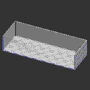 |  | 

---
## A_S834
* Unit count: (WxLxH) 8 x 3 x 4
* Component size: (WxLxH) 200 x 75 x 60 mm

| **A_S834** | **A_S834R** | 
| --- | --- | 
|  | With rail | 
| STL: compile manually | STL: compile manually | 
|  |  | 

---
## A_S836
* Unit count: (WxLxH) 8 x 3 x 6
* Component size: (WxLxH) 200 x 75 x 90 mm

| **A_S836** | **A_S836R** | 
| --- | --- | 
|  | With rail | 
| STL: compile manually | STL: compile manually | 
|  |  | 

---
## A_S838
* Unit count: (WxLxH) 8 x 3 x 8
* Component size: (WxLxH) 200 x 75 x 120 mm

| **A_S838** | **A_S838R** | 
| --- | --- | 
|  | With rail | 
| STL: compile manually | STL: compile manually | 
|  |  | 

---
## A_S841
* Unit count: (WxLxH) 8 x 4 x 1
* Component size: (WxLxH) 200 x 100 x 15 mm

| **A_S841** | **A_S841R** | 
| --- | --- | 
|  | With rail | 
| STL: [shelves](https://github.com/CZDanol/DNLTray/releases/latest/download/DNLTray_A_shelves.zip) | STL: [shelves](https://github.com/CZDanol/DNLTray/releases/latest/download/DNLTray_A_shelves.zip) | 
|  |  | 

---
## A_S842
* Unit count: (WxLxH) 8 x 4 x 2
* Component size: (WxLxH) 200 x 100 x 30 mm

| **A_S842** | **A_S842R** | 
| --- | --- | 
|  | With rail | 
| STL: [shelves](https://github.com/CZDanol/DNLTray/releases/latest/download/DNLTray_A_shelves.zip) | STL: [shelves](https://github.com/CZDanol/DNLTray/releases/latest/download/DNLTray_A_shelves.zip) | 
|  |  | 

---
## A_S843
* Unit count: (WxLxH) 8 x 4 x 3
* Component size: (WxLxH) 200 x 100 x 45 mm

| **A_S843** | **A_S843R** | 
| --- | --- | 
|  | With rail | 
| STL: compile manually | STL: compile manually | 
|  |  | 

---
## A_S844
* Unit count: (WxLxH) 8 x 4 x 4
* Component size: (WxLxH) 200 x 100 x 60 mm

| **A_S844** | **A_S844R** | 
| --- | --- | 
|  | With rail | 
| STL: [shelves](https://github.com/CZDanol/DNLTray/releases/latest/download/DNLTray_A_shelves.zip) | STL: [shelves](https://github.com/CZDanol/DNLTray/releases/latest/download/DNLTray_A_shelves.zip) | 
|  | 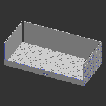 | 

---
## A_S846
* Unit count: (WxLxH) 8 x 4 x 6
* Component size: (WxLxH) 200 x 100 x 90 mm

| **A_S846** | **A_S846R** | 
| --- | --- | 
|  | With rail | 
| STL: [shelves](https://github.com/CZDanol/DNLTray/releases/latest/download/DNLTray_A_shelves.zip) | STL: [shelves](https://github.com/CZDanol/DNLTray/releases/latest/download/DNLTray_A_shelves.zip) | 
|  |  | 

---
## A_S848
* Unit count: (WxLxH) 8 x 4 x 8
* Component size: (WxLxH) 200 x 100 x 120 mm

| **A_S848** | **A_S848R** | 
| --- | --- | 
|  | With rail | 
| STL: [shelves](https://github.com/CZDanol/DNLTray/releases/latest/download/DNLTray_A_shelves.zip) | STL: [shelves](https://github.com/CZDanol/DNLTray/releases/latest/download/DNLTray_A_shelves.zip) | 
|  |  | 

---
## A_S861
* Unit count: (WxLxH) 8 x 6 x 1
* Component size: (WxLxH) 200 x 150 x 15 mm

| **A_S861** | **A_S861R** | 
| --- | --- | 
|  | With rail | 
| STL: [shelves](https://github.com/CZDanol/DNLTray/releases/latest/download/DNLTray_A_shelves.zip) | STL: [shelves](https://github.com/CZDanol/DNLTray/releases/latest/download/DNLTray_A_shelves.zip) | 
|  |  | 

---
## A_S862
* Unit count: (WxLxH) 8 x 6 x 2
* Component size: (WxLxH) 200 x 150 x 30 mm

| **A_S862** | **A_S862R** | 
| --- | --- | 
|  | With rail | 
| STL: [shelves](https://github.com/CZDanol/DNLTray/releases/latest/download/DNLTray_A_shelves.zip) | STL: [shelves](https://github.com/CZDanol/DNLTray/releases/latest/download/DNLTray_A_shelves.zip) | 
|  |  | 

---
## A_S863
* Unit count: (WxLxH) 8 x 6 x 3
* Component size: (WxLxH) 200 x 150 x 45 mm

| **A_S863** | **A_S863R** | 
| --- | --- | 
|  | With rail | 
| STL: compile manually | STL: compile manually | 
|  |  | 

---
## A_S864
* Unit count: (WxLxH) 8 x 6 x 4
* Component size: (WxLxH) 200 x 150 x 60 mm

| **A_S864** | **A_S864R** | 
| --- | --- | 
|  | With rail | 
| STL: [shelves](https://github.com/CZDanol/DNLTray/releases/latest/download/DNLTray_A_shelves.zip) | STL: [shelves](https://github.com/CZDanol/DNLTray/releases/latest/download/DNLTray_A_shelves.zip) | 
|  |  | 

---
## A_S866
* Unit count: (WxLxH) 8 x 6 x 6
* Component size: (WxLxH) 200 x 150 x 90 mm

| **A_S866** | **A_S866R** | 
| --- | --- | 
|  | With rail | 
| STL: [shelves](https://github.com/CZDanol/DNLTray/releases/latest/download/DNLTray_A_shelves.zip) | STL: [shelves](https://github.com/CZDanol/DNLTray/releases/latest/download/DNLTray_A_shelves.zip) | 
|  |  | 

---
## A_S868
* Unit count: (WxLxH) 8 x 6 x 8
* Component size: (WxLxH) 200 x 150 x 120 mm

| **A_S868** | **A_S868R** | 
| --- | --- | 
|  | With rail | 
| STL: [shelves](https://github.com/CZDanol/DNLTray/releases/latest/download/DNLTray_A_shelves.zip) | STL: [shelves](https://github.com/CZDanol/DNLTray/releases/latest/download/DNLTray_A_shelves.zip) | 
|  |  | 

---
## A_S881
* Unit count: (WxLxH) 8 x 8 x 1
* Component size: (WxLxH) 200 x 200 x 15 mm

| **A_S881** | **A_S881R** | 
| --- | --- | 
|  | With rail | 
| STL: [shelves](https://github.com/CZDanol/DNLTray/releases/latest/download/DNLTray_A_shelves.zip) | STL: [shelves](https://github.com/CZDanol/DNLTray/releases/latest/download/DNLTray_A_shelves.zip) | 
|  |  | 

---
## A_S882
* Unit count: (WxLxH) 8 x 8 x 2
* Component size: (WxLxH) 200 x 200 x 30 mm

| **A_S882** | **A_S882R** | 
| --- | --- | 
|  | With rail | 
| STL: [shelves](https://github.com/CZDanol/DNLTray/releases/latest/download/DNLTray_A_shelves.zip) | STL: [shelves](https://github.com/CZDanol/DNLTray/releases/latest/download/DNLTray_A_shelves.zip) | 
|  |  | 

---
## A_S883
* Unit count: (WxLxH) 8 x 8 x 3
* Component size: (WxLxH) 200 x 200 x 45 mm

| **A_S883** | **A_S883R** | 
| --- | --- | 
|  | With rail | 
| STL: compile manually | STL: compile manually | 
|  |  | 

---
## A_S884
* Unit count: (WxLxH) 8 x 8 x 4
* Component size: (WxLxH) 200 x 200 x 60 mm

| **A_S884** | **A_S884R** | 
| --- | --- | 
|  | With rail | 
| STL: [shelves](https://github.com/CZDanol/DNLTray/releases/latest/download/DNLTray_A_shelves.zip) | STL: [shelves](https://github.com/CZDanol/DNLTray/releases/latest/download/DNLTray_A_shelves.zip) | 
|  |  | 

---
## A_S886
* Unit count: (WxLxH) 8 x 8 x 6
* Component size: (WxLxH) 200 x 200 x 90 mm

| **A_S886** | **A_S886R** | 
| --- | --- | 
|  | With rail | 
| STL: [shelves](https://github.com/CZDanol/DNLTray/releases/latest/download/DNLTray_A_shelves.zip) | STL: [shelves](https://github.com/CZDanol/DNLTray/releases/latest/download/DNLTray_A_shelves.zip) | 
|  |  | 

---
## A_S888
* Unit count: (WxLxH) 8 x 8 x 8
* Component size: (WxLxH) 200 x 200 x 120 mm

| **A_S888** | **A_S888R** | 
| --- | --- | 
|  | With rail | 
| STL: [shelves](https://github.com/CZDanol/DNLTray/releases/latest/download/DNLTray_A_shelves.zip) | STL: [shelves](https://github.com/CZDanol/DNLTray/releases/latest/download/DNLTray_A_shelves.zip) | 
|  |  | 

---
