# A_T333
* System: A
* Unit count: 3 x 3 x 3 units
* Component size: (WxLxH) 75 x 75 x 45 mm
* Path: `models/A__system_A/T__trays/333__3x3x3_units__75x75x45_mm`
# Components
## A_T333_1-2-1_1
| **A_T333F_1-2-1_1** | 
| --- | 
| STL: [compile manually](https://github.com/CZDanol/DNLTray#how-to-compile) | 
| 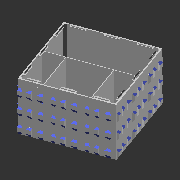 | 

---
## A_T333_1x1
| **A_T333F_1x1** | 
| --- | 
| STL: [compile manually](https://github.com/CZDanol/DNLTray#how-to-compile) | 
| 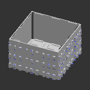 | 

---
## A_T333_2_dg
| **A_T333F_2_dg** | 
| --- | 
| STL: [compile manually](https://github.com/CZDanol/DNLTray#how-to-compile) | 
| 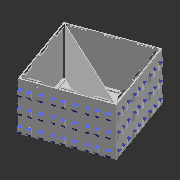 | 

---
## A_T333_2x1
| **A_T333F_2x1** | 
| --- | 
| STL: [compile manually](https://github.com/CZDanol/DNLTray#how-to-compile) | 
| 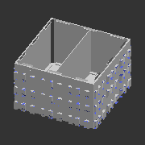 | 

---
## A_T333_2x1_1x1
| **A_T333F_2x1_1x1** | 
| --- | 
| STL: [compile manually](https://github.com/CZDanol/DNLTray#how-to-compile) | 
| 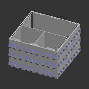 | 

---
## A_T333_2x1_1x1h2_2x1
| **A_T333F_2x1_1x1h2_2x1** | 
| --- | 
| STL: [compile manually](https://github.com/CZDanol/DNLTray#how-to-compile) | 
| 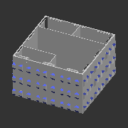 | 

---
## A_T333_2x2
| **A_T333F_2x2** | 
| --- | 
| STL: [compile manually](https://github.com/CZDanol/DNLTray#how-to-compile) | 
| 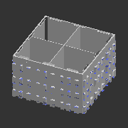 | 

---
## A_T333_2x2_2x1
| **A_T333F_2x2_2x1** | 
| --- | 
| STL: [compile manually](https://github.com/CZDanol/DNLTray#how-to-compile) | 
|  | 

---
## A_T333_3x1
| **A_T333F_3x1** | 
| --- | 
| STL: [compile manually](https://github.com/CZDanol/DNLTray#how-to-compile) | 
| 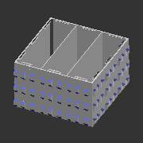 | 

---
## A_T333_3x1_1x1
| **A_T333F_3x1_1x1** | 
| --- | 
| STL: [compile manually](https://github.com/CZDanol/DNLTray#how-to-compile) | 
| 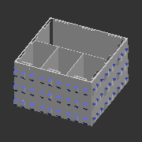 | 

---
## A_T333_3x2
| **A_T333F_3x2** | 
| --- | 
| STL: [compile manually](https://github.com/CZDanol/DNLTray#how-to-compile) | 
| 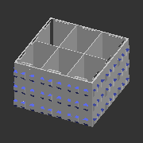 | 

---
## A_T333_3x3
| **A_T333F_3x3** | 
| --- | 
| STL: [compile manually](https://github.com/CZDanol/DNLTray#how-to-compile) | 
| 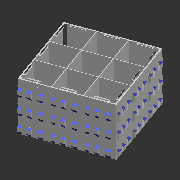 | 

---
## A_T333_4x1
| **A_T333F_4x1** | 
| --- | 
| STL: [compile manually](https://github.com/CZDanol/DNLTray#how-to-compile) | 
| 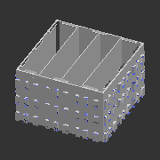 | 

---
## A_T333_4x1_1x1
| **A_T333F_4x1_1x1** | 
| --- | 
| STL: [compile manually](https://github.com/CZDanol/DNLTray#how-to-compile) | 
| 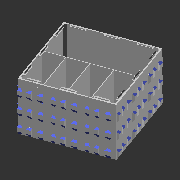 | 

---
## A_T333_4x2
| **A_T333F_4x2** | 
| --- | 
| STL: [compile manually](https://github.com/CZDanol/DNLTray#how-to-compile) | 
|  | 

---
## A_T333_4x2_1-2-1
| **A_T333F_4x2_1-2-1** | 
| --- | 
| STL: [compile manually](https://github.com/CZDanol/DNLTray#how-to-compile) | 
| 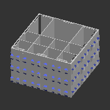 | 

---
## A_T333_4x2_2x1
| **A_T333F_4x2_2x1** | 
| --- | 
| STL: [compile manually](https://github.com/CZDanol/DNLTray#how-to-compile) | 
| 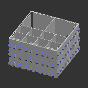 | 

---
## A_T333_4x2_4x1
| **A_T333F_4x2_4x1** | 
| --- | 
| STL: [compile manually](https://github.com/CZDanol/DNLTray#how-to-compile) | 
| 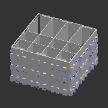 | 

---
## A_T333_4x4
| **A_T333F_4x4** | 
| --- | 
| STL: [compile manually](https://github.com/CZDanol/DNLTray#how-to-compile) | 
| 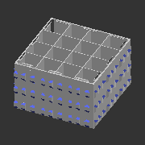 | 

---
## A_T333_8x1
| **A_T333F_8x1** | 
| --- | 
| STL: [compile manually](https://github.com/CZDanol/DNLTray#how-to-compile) | 
| 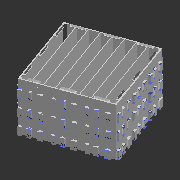 | 

---
## A_T333_8x2
| **A_T333F_8x2** | 
| --- | 
| STL: [compile manually](https://github.com/CZDanol/DNLTray#how-to-compile) | 
| 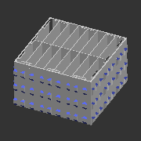 | 

---
## A_T333_8x3
| **A_T333F_8x3** | 
| --- | 
| STL: [compile manually](https://github.com/CZDanol/DNLTray#how-to-compile) | 
| 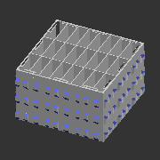 | 

---
## A_T333_8x4
| **A_T333F_8x4** | 
| --- | 
| STL: [compile manually](https://github.com/CZDanol/DNLTray#how-to-compile) | 
| 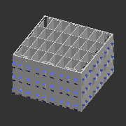 | 

---
## A_T333_8x8
| **A_T333F_8x8** | 
| --- | 
| STL: [compile manually](https://github.com/CZDanol/DNLTray#how-to-compile) | 
| 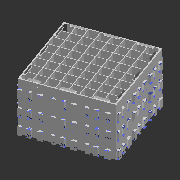 | 

---
## A_T333_sqc
| **A_T333F_sqc** | 
| --- | 
| STL: [compile manually](https://github.com/CZDanol/DNLTray#how-to-compile) | 
| 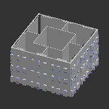 | 

---
## A_T333_sqc_alt
| **A_T333F_sqc_alt** | 
| --- | 
| STL: [compile manually](https://github.com/CZDanol/DNLTray#how-to-compile) | 
| 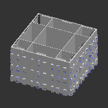 | 

---
## A_T333_sqc_dg
| **A_T333F_sqc_dg** | 
| --- | 
| STL: [compile manually](https://github.com/CZDanol/DNLTray#how-to-compile) | 
| 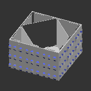 | 

---
## A_T333_tr4
| **A_T333F_tr4** | 
| --- | 
| STL: [compile manually](https://github.com/CZDanol/DNLTray#how-to-compile) | 
| 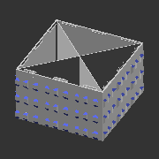 | 

---
