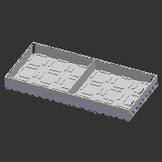
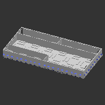
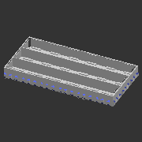
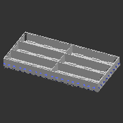
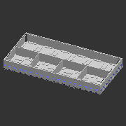
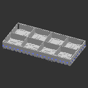
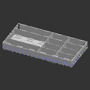
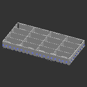
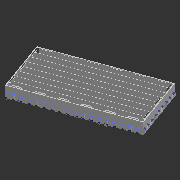
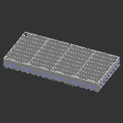

# A_T631
* System: A
* Unit count: 6 x 3 x 1 units
* Component size: (WxLxH) 150 x 75 x 15 mm
* Path: `models/A__system_A/T__trays/631__6x3x1_units__150x75x15_mm`
# Components
## A_T631_1-2-1_1
| **A_T631F_1-2-1_1** | **A_T631F_1-2-1_1R** | 
| --- | --- | 
|  | Rotated pattern | 
|  |  | 

---
## A_T631_1x1
| **A_T631F_1x1** | 
| --- | 
|  | 

---
## A_T631_2_dg
| **A_T631F_2_dg** | **A_T631F_2_dgR** | 
| --- | --- | 
|  | Rotated pattern | 
|  |  | 

---
## A_T631_2x1
| **A_T631F_2x1** | **A_T631F_2x1R** | 
| --- | --- | 
|  | Rotated pattern | 
|  |  | 

---
## A_T631_2x1_1x1
| **A_T631F_2x1_1x1** | **A_T631F_2x1_1x1R** | 
| --- | --- | 
|  | Rotated pattern | 
|  |  | 

---
## A_T631_2x1_1x1h2_2x1
| **A_T631F_2x1_1x1h2_2x1** | **A_T631F_2x1_1x1h2_2x1R** | 
| --- | --- | 
|  | Rotated pattern | 
|  |  | 

---
## A_T631_2x2
| **A_T631F_2x2** | 
| --- | 
|  | 

---
## A_T631_2x2_2x1
| **A_T631F_2x2_2x1** | **A_T631F_2x2_2x1R** | 
| --- | --- | 
|  | Rotated pattern | 
|  |  | 

---
## A_T631_3x1
| **A_T631F_3x1** | **A_T631F_3x1R** | 
| --- | --- | 
|  | Rotated pattern | 
|  |  | 

---
## A_T631_3x1_1x1
| **A_T631F_3x1_1x1** | **A_T631F_3x1_1x1R** | 
| --- | --- | 
|  | Rotated pattern | 
|  |  | 

---
## A_T631_3x2
| **A_T631F_3x2** | **A_T631F_3x2R** | 
| --- | --- | 
|  | Rotated pattern | 
|  |  | 

---
## A_T631_3x3
| **A_T631F_3x3** | 
| --- | 
|  | 

---
## A_T631_4x1
| **A_T631F_4x1** | **A_T631F_4x1R** | 
| --- | --- | 
|  | Rotated pattern | 
|  |  | 

---
## A_T631_4x1_1x1
| **A_T631F_4x1_1x1** | **A_T631F_4x1_1x1R** | 
| --- | --- | 
|  | Rotated pattern | 
|  |  | 

---
## A_T631_4x2
| **A_T631F_4x2** | **A_T631F_4x2R** | 
| --- | --- | 
|  | Rotated pattern | 
|  |  | 

---
## A_T631_4x2_1-2-1
| **A_T631F_4x2_1-2-1** | **A_T631F_4x2_1-2-1R** | 
| --- | --- | 
|  | Rotated pattern | 
|  |  | 

---
## A_T631_4x2_2x1
| **A_T631F_4x2_2x1** | **A_T631F_4x2_2x1R** | 
| --- | --- | 
|  | Rotated pattern | 
|  |  | 

---
## A_T631_4x2_4x1
| **A_T631F_4x2_4x1** | **A_T631F_4x2_4x1R** | 
| --- | --- | 
|  | Rotated pattern | 
|  |  | 

---
## A_T631_4x4
| **A_T631F_4x4** | 
| --- | 
|  | 

---
## A_T631_8x1
| **A_T631F_8x1** | **A_T631F_8x1R** | 
| --- | --- | 
|  | Rotated pattern | 
|  |  | 

---
## A_T631_8x2
| **A_T631F_8x2** | **A_T631F_8x2R** | 
| --- | --- | 
|  | Rotated pattern | 
|  |  | 

---
## A_T631_8x3
| **A_T631F_8x3** | **A_T631F_8x3R** | 
| --- | --- | 
|  | Rotated pattern | 
|  |  | 

---
## A_T631_8x4
| **A_T631F_8x4** | **A_T631F_8x4R** | 
| --- | --- | 
|  | Rotated pattern | 
|  |  | 

---
## A_T631_8x8
| **A_T631F_8x8** | 
| --- | 
|  | 

---
## A_T631_sqc
| **A_T631F_sqc** | 
| --- | 
|  | 

---
## A_T631_sqc_alt
| **A_T631F_sqc_alt** | 
| --- | 
|  | 

---
## A_T631_sqc_dg
| **A_T631F_sqc_dg** | 
| --- | 
|  | 

---
## A_T631_tr4
| **A_T631F_tr4** | 
| --- | 
|  | 

---
