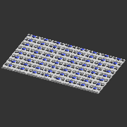

# A_W*
* System: A
* Path: `models/A__system_A/W__walls`
# Components
## A_W101
* Unit count: (WxLxH) 1 x 0 x 1
* Component size: (WxLxH) 25 x 0 x 15 mm

| **A_W101** | 
| --- | 
| STL: [drawers](https://github.com/CZDanol/DNLTray/releases/latest/download/DNLTray_A_drawers.zip), [trays](https://github.com/CZDanol/DNLTray/releases/latest/download/DNLTray_A_trays.zip), [shelves](https://github.com/CZDanol/DNLTray/releases/latest/download/DNLTray_A_shelves.zip) | 
|  | 

---
## A_W1012
* Unit count: (WxLxH) 1 x 0 x 12
* Component size: (WxLxH) 25 x 0 x 180 mm

| **A_W1012** | 
| --- | 
| STL: [drawers](https://github.com/CZDanol/DNLTray/releases/latest/download/DNLTray_A_drawers.zip), [trays](https://github.com/CZDanol/DNLTray/releases/latest/download/DNLTray_A_trays.zip), [shelves](https://github.com/CZDanol/DNLTray/releases/latest/download/DNLTray_A_shelves.zip) | 
|  | 

---
## A_W1016
* Unit count: (WxLxH) 1 x 0 x 16
* Component size: (WxLxH) 25 x 0 x 240 mm

| **A_W1016** | 
| --- | 
| STL: [drawers](https://github.com/CZDanol/DNLTray/releases/latest/download/DNLTray_A_drawers.zip), [trays](https://github.com/CZDanol/DNLTray/releases/latest/download/DNLTray_A_trays.zip), [shelves](https://github.com/CZDanol/DNLTray/releases/latest/download/DNLTray_A_shelves.zip) | 
|  | 

---
## A_W102
* Unit count: (WxLxH) 1 x 0 x 2
* Component size: (WxLxH) 25 x 0 x 30 mm

| **A_W102** | 
| --- | 
| STL: [drawers](https://github.com/CZDanol/DNLTray/releases/latest/download/DNLTray_A_drawers.zip), [trays](https://github.com/CZDanol/DNLTray/releases/latest/download/DNLTray_A_trays.zip), [shelves](https://github.com/CZDanol/DNLTray/releases/latest/download/DNLTray_A_shelves.zip) | 
|  | 

---
## A_W104
* Unit count: (WxLxH) 1 x 0 x 4
* Component size: (WxLxH) 25 x 0 x 60 mm

| **A_W104** | 
| --- | 
| STL: [drawers](https://github.com/CZDanol/DNLTray/releases/latest/download/DNLTray_A_drawers.zip), [trays](https://github.com/CZDanol/DNLTray/releases/latest/download/DNLTray_A_trays.zip), [shelves](https://github.com/CZDanol/DNLTray/releases/latest/download/DNLTray_A_shelves.zip) | 
|  | 

---
## A_W106
* Unit count: (WxLxH) 1 x 0 x 6
* Component size: (WxLxH) 25 x 0 x 90 mm

| **A_W106** | 
| --- | 
| STL: [drawers](https://github.com/CZDanol/DNLTray/releases/latest/download/DNLTray_A_drawers.zip), [trays](https://github.com/CZDanol/DNLTray/releases/latest/download/DNLTray_A_trays.zip), [shelves](https://github.com/CZDanol/DNLTray/releases/latest/download/DNLTray_A_shelves.zip) | 
|  | 

---
## A_W108
* Unit count: (WxLxH) 1 x 0 x 8
* Component size: (WxLxH) 25 x 0 x 120 mm

| **A_W108** | 
| --- | 
| STL: [drawers](https://github.com/CZDanol/DNLTray/releases/latest/download/DNLTray_A_drawers.zip), [trays](https://github.com/CZDanol/DNLTray/releases/latest/download/DNLTray_A_trays.zip), [shelves](https://github.com/CZDanol/DNLTray/releases/latest/download/DNLTray_A_shelves.zip) | 
|  | 

---
## A_W201
* Unit count: (WxLxH) 2 x 0 x 1
* Component size: (WxLxH) 50 x 0 x 15 mm

| **A_W201** | 
| --- | 
| STL: [drawers](https://github.com/CZDanol/DNLTray/releases/latest/download/DNLTray_A_drawers.zip), [trays](https://github.com/CZDanol/DNLTray/releases/latest/download/DNLTray_A_trays.zip), [shelves](https://github.com/CZDanol/DNLTray/releases/latest/download/DNLTray_A_shelves.zip) | 
|  | 

---
## A_W2012
* Unit count: (WxLxH) 2 x 0 x 12
* Component size: (WxLxH) 50 x 0 x 180 mm

| **A_W2012** | 
| --- | 
| STL: [drawers](https://github.com/CZDanol/DNLTray/releases/latest/download/DNLTray_A_drawers.zip), [trays](https://github.com/CZDanol/DNLTray/releases/latest/download/DNLTray_A_trays.zip), [shelves](https://github.com/CZDanol/DNLTray/releases/latest/download/DNLTray_A_shelves.zip) | 
|  | 

---
## A_W2016
* Unit count: (WxLxH) 2 x 0 x 16
* Component size: (WxLxH) 50 x 0 x 240 mm

| **A_W2016** | 
| --- | 
| STL: [drawers](https://github.com/CZDanol/DNLTray/releases/latest/download/DNLTray_A_drawers.zip), [trays](https://github.com/CZDanol/DNLTray/releases/latest/download/DNLTray_A_trays.zip), [shelves](https://github.com/CZDanol/DNLTray/releases/latest/download/DNLTray_A_shelves.zip) | 
|  | 

---
## A_W202
* Unit count: (WxLxH) 2 x 0 x 2
* Component size: (WxLxH) 50 x 0 x 30 mm

| **A_W202** | 
| --- | 
| STL: [drawers](https://github.com/CZDanol/DNLTray/releases/latest/download/DNLTray_A_drawers.zip), [trays](https://github.com/CZDanol/DNLTray/releases/latest/download/DNLTray_A_trays.zip), [shelves](https://github.com/CZDanol/DNLTray/releases/latest/download/DNLTray_A_shelves.zip) | 
|  | 

---
## A_W204
* Unit count: (WxLxH) 2 x 0 x 4
* Component size: (WxLxH) 50 x 0 x 60 mm

| **A_W204** | 
| --- | 
| STL: [drawers](https://github.com/CZDanol/DNLTray/releases/latest/download/DNLTray_A_drawers.zip), [trays](https://github.com/CZDanol/DNLTray/releases/latest/download/DNLTray_A_trays.zip), [shelves](https://github.com/CZDanol/DNLTray/releases/latest/download/DNLTray_A_shelves.zip) | 
|  | 

---
## A_W206
* Unit count: (WxLxH) 2 x 0 x 6
* Component size: (WxLxH) 50 x 0 x 90 mm

| **A_W206** | 
| --- | 
| STL: [drawers](https://github.com/CZDanol/DNLTray/releases/latest/download/DNLTray_A_drawers.zip), [trays](https://github.com/CZDanol/DNLTray/releases/latest/download/DNLTray_A_trays.zip), [shelves](https://github.com/CZDanol/DNLTray/releases/latest/download/DNLTray_A_shelves.zip) | 
|  | 

---
## A_W208
* Unit count: (WxLxH) 2 x 0 x 8
* Component size: (WxLxH) 50 x 0 x 120 mm

| **A_W208** | 
| --- | 
| STL: [drawers](https://github.com/CZDanol/DNLTray/releases/latest/download/DNLTray_A_drawers.zip), [trays](https://github.com/CZDanol/DNLTray/releases/latest/download/DNLTray_A_trays.zip), [shelves](https://github.com/CZDanol/DNLTray/releases/latest/download/DNLTray_A_shelves.zip) | 
|  | 

---
## A_W301
* Unit count: (WxLxH) 3 x 0 x 1
* Component size: (WxLxH) 75 x 0 x 15 mm

| **A_W301** | 
| --- | 
| STL: [drawers](https://github.com/CZDanol/DNLTray/releases/latest/download/DNLTray_A_drawers.zip), [trays](https://github.com/CZDanol/DNLTray/releases/latest/download/DNLTray_A_trays.zip), [shelves](https://github.com/CZDanol/DNLTray/releases/latest/download/DNLTray_A_shelves.zip) | 
|  | 

---
## A_W3012
* Unit count: (WxLxH) 3 x 0 x 12
* Component size: (WxLxH) 75 x 0 x 180 mm

| **A_W3012** | 
| --- | 
| STL: [drawers](https://github.com/CZDanol/DNLTray/releases/latest/download/DNLTray_A_drawers.zip), [trays](https://github.com/CZDanol/DNLTray/releases/latest/download/DNLTray_A_trays.zip), [shelves](https://github.com/CZDanol/DNLTray/releases/latest/download/DNLTray_A_shelves.zip) | 
|  | 

---
## A_W3016
* Unit count: (WxLxH) 3 x 0 x 16
* Component size: (WxLxH) 75 x 0 x 240 mm

| **A_W3016** | 
| --- | 
| STL: [drawers](https://github.com/CZDanol/DNLTray/releases/latest/download/DNLTray_A_drawers.zip), [trays](https://github.com/CZDanol/DNLTray/releases/latest/download/DNLTray_A_trays.zip), [shelves](https://github.com/CZDanol/DNLTray/releases/latest/download/DNLTray_A_shelves.zip) | 
|  | 

---
## A_W302
* Unit count: (WxLxH) 3 x 0 x 2
* Component size: (WxLxH) 75 x 0 x 30 mm

| **A_W302** | 
| --- | 
| STL: [drawers](https://github.com/CZDanol/DNLTray/releases/latest/download/DNLTray_A_drawers.zip), [trays](https://github.com/CZDanol/DNLTray/releases/latest/download/DNLTray_A_trays.zip), [shelves](https://github.com/CZDanol/DNLTray/releases/latest/download/DNLTray_A_shelves.zip) | 
|  | 

---
## A_W304
* Unit count: (WxLxH) 3 x 0 x 4
* Component size: (WxLxH) 75 x 0 x 60 mm

| **A_W304** | 
| --- | 
| STL: [drawers](https://github.com/CZDanol/DNLTray/releases/latest/download/DNLTray_A_drawers.zip), [trays](https://github.com/CZDanol/DNLTray/releases/latest/download/DNLTray_A_trays.zip), [shelves](https://github.com/CZDanol/DNLTray/releases/latest/download/DNLTray_A_shelves.zip) | 
|  | 

---
## A_W306
* Unit count: (WxLxH) 3 x 0 x 6
* Component size: (WxLxH) 75 x 0 x 90 mm

| **A_W306** | 
| --- | 
| STL: [drawers](https://github.com/CZDanol/DNLTray/releases/latest/download/DNLTray_A_drawers.zip), [trays](https://github.com/CZDanol/DNLTray/releases/latest/download/DNLTray_A_trays.zip), [shelves](https://github.com/CZDanol/DNLTray/releases/latest/download/DNLTray_A_shelves.zip) | 
|  | 

---
## A_W308
* Unit count: (WxLxH) 3 x 0 x 8
* Component size: (WxLxH) 75 x 0 x 120 mm

| **A_W308** | 
| --- | 
| STL: [drawers](https://github.com/CZDanol/DNLTray/releases/latest/download/DNLTray_A_drawers.zip), [trays](https://github.com/CZDanol/DNLTray/releases/latest/download/DNLTray_A_trays.zip), [shelves](https://github.com/CZDanol/DNLTray/releases/latest/download/DNLTray_A_shelves.zip) | 
|  | 

---
## A_W401
* Unit count: (WxLxH) 4 x 0 x 1
* Component size: (WxLxH) 100 x 0 x 15 mm

| **A_W401** | 
| --- | 
| STL: [drawers](https://github.com/CZDanol/DNLTray/releases/latest/download/DNLTray_A_drawers.zip), [trays](https://github.com/CZDanol/DNLTray/releases/latest/download/DNLTray_A_trays.zip), [shelves](https://github.com/CZDanol/DNLTray/releases/latest/download/DNLTray_A_shelves.zip) | 
|  | 

---
## A_W4012
* Unit count: (WxLxH) 4 x 0 x 12
* Component size: (WxLxH) 100 x 0 x 180 mm

| **A_W4012** | 
| --- | 
| STL: [drawers](https://github.com/CZDanol/DNLTray/releases/latest/download/DNLTray_A_drawers.zip), [trays](https://github.com/CZDanol/DNLTray/releases/latest/download/DNLTray_A_trays.zip), [shelves](https://github.com/CZDanol/DNLTray/releases/latest/download/DNLTray_A_shelves.zip) | 
|  | 

---
## A_W4016
* Unit count: (WxLxH) 4 x 0 x 16
* Component size: (WxLxH) 100 x 0 x 240 mm

| **A_W4016** | 
| --- | 
| STL: [drawers](https://github.com/CZDanol/DNLTray/releases/latest/download/DNLTray_A_drawers.zip), [trays](https://github.com/CZDanol/DNLTray/releases/latest/download/DNLTray_A_trays.zip), [shelves](https://github.com/CZDanol/DNLTray/releases/latest/download/DNLTray_A_shelves.zip) | 
|  | 

---
## A_W402
* Unit count: (WxLxH) 4 x 0 x 2
* Component size: (WxLxH) 100 x 0 x 30 mm

| **A_W402** | 
| --- | 
| STL: [drawers](https://github.com/CZDanol/DNLTray/releases/latest/download/DNLTray_A_drawers.zip), [trays](https://github.com/CZDanol/DNLTray/releases/latest/download/DNLTray_A_trays.zip), [shelves](https://github.com/CZDanol/DNLTray/releases/latest/download/DNLTray_A_shelves.zip) | 
|  | 

---
## A_W404
* Unit count: (WxLxH) 4 x 0 x 4
* Component size: (WxLxH) 100 x 0 x 60 mm

| **A_W404** | 
| --- | 
| STL: [drawers](https://github.com/CZDanol/DNLTray/releases/latest/download/DNLTray_A_drawers.zip), [trays](https://github.com/CZDanol/DNLTray/releases/latest/download/DNLTray_A_trays.zip), [shelves](https://github.com/CZDanol/DNLTray/releases/latest/download/DNLTray_A_shelves.zip) | 
|  | 

---
## A_W406
* Unit count: (WxLxH) 4 x 0 x 6
* Component size: (WxLxH) 100 x 0 x 90 mm

| **A_W406** | 
| --- | 
| STL: [drawers](https://github.com/CZDanol/DNLTray/releases/latest/download/DNLTray_A_drawers.zip), [trays](https://github.com/CZDanol/DNLTray/releases/latest/download/DNLTray_A_trays.zip), [shelves](https://github.com/CZDanol/DNLTray/releases/latest/download/DNLTray_A_shelves.zip) | 
|  | 

---
## A_W408
* Unit count: (WxLxH) 4 x 0 x 8
* Component size: (WxLxH) 100 x 0 x 120 mm

| **A_W408** | 
| --- | 
| STL: [drawers](https://github.com/CZDanol/DNLTray/releases/latest/download/DNLTray_A_drawers.zip), [trays](https://github.com/CZDanol/DNLTray/releases/latest/download/DNLTray_A_trays.zip), [shelves](https://github.com/CZDanol/DNLTray/releases/latest/download/DNLTray_A_shelves.zip) | 
|  | 

---
## A_W601
* Unit count: (WxLxH) 6 x 0 x 1
* Component size: (WxLxH) 150 x 0 x 15 mm

| **A_W601** | 
| --- | 
| STL: [drawers](https://github.com/CZDanol/DNLTray/releases/latest/download/DNLTray_A_drawers.zip), [trays](https://github.com/CZDanol/DNLTray/releases/latest/download/DNLTray_A_trays.zip), [shelves](https://github.com/CZDanol/DNLTray/releases/latest/download/DNLTray_A_shelves.zip) | 
|  | 

---
## A_W6012
* Unit count: (WxLxH) 6 x 0 x 12
* Component size: (WxLxH) 150 x 0 x 180 mm

| **A_W6012** | 
| --- | 
| STL: [drawers](https://github.com/CZDanol/DNLTray/releases/latest/download/DNLTray_A_drawers.zip), [trays](https://github.com/CZDanol/DNLTray/releases/latest/download/DNLTray_A_trays.zip), [shelves](https://github.com/CZDanol/DNLTray/releases/latest/download/DNLTray_A_shelves.zip) | 
|  | 

---
## A_W6016
* Unit count: (WxLxH) 6 x 0 x 16
* Component size: (WxLxH) 150 x 0 x 240 mm

| **A_W6016** | 
| --- | 
| STL: [drawers](https://github.com/CZDanol/DNLTray/releases/latest/download/DNLTray_A_drawers.zip), [trays](https://github.com/CZDanol/DNLTray/releases/latest/download/DNLTray_A_trays.zip), [shelves](https://github.com/CZDanol/DNLTray/releases/latest/download/DNLTray_A_shelves.zip) | 
|  | 

---
## A_W602
* Unit count: (WxLxH) 6 x 0 x 2
* Component size: (WxLxH) 150 x 0 x 30 mm

| **A_W602** | 
| --- | 
| STL: [drawers](https://github.com/CZDanol/DNLTray/releases/latest/download/DNLTray_A_drawers.zip), [trays](https://github.com/CZDanol/DNLTray/releases/latest/download/DNLTray_A_trays.zip), [shelves](https://github.com/CZDanol/DNLTray/releases/latest/download/DNLTray_A_shelves.zip) | 
|  | 

---
## A_W604
* Unit count: (WxLxH) 6 x 0 x 4
* Component size: (WxLxH) 150 x 0 x 60 mm

| **A_W604** | 
| --- | 
| STL: [drawers](https://github.com/CZDanol/DNLTray/releases/latest/download/DNLTray_A_drawers.zip), [trays](https://github.com/CZDanol/DNLTray/releases/latest/download/DNLTray_A_trays.zip), [shelves](https://github.com/CZDanol/DNLTray/releases/latest/download/DNLTray_A_shelves.zip) | 
|  | 

---
## A_W606
* Unit count: (WxLxH) 6 x 0 x 6
* Component size: (WxLxH) 150 x 0 x 90 mm

| **A_W606** | 
| --- | 
| STL: [drawers](https://github.com/CZDanol/DNLTray/releases/latest/download/DNLTray_A_drawers.zip), [trays](https://github.com/CZDanol/DNLTray/releases/latest/download/DNLTray_A_trays.zip), [shelves](https://github.com/CZDanol/DNLTray/releases/latest/download/DNLTray_A_shelves.zip) | 
|  | 

---
## A_W608
* Unit count: (WxLxH) 6 x 0 x 8
* Component size: (WxLxH) 150 x 0 x 120 mm

| **A_W608** | 
| --- | 
| STL: [drawers](https://github.com/CZDanol/DNLTray/releases/latest/download/DNLTray_A_drawers.zip), [trays](https://github.com/CZDanol/DNLTray/releases/latest/download/DNLTray_A_trays.zip), [shelves](https://github.com/CZDanol/DNLTray/releases/latest/download/DNLTray_A_shelves.zip) | 
|  | 

---
## A_W801
* Unit count: (WxLxH) 8 x 0 x 1
* Component size: (WxLxH) 200 x 0 x 15 mm

| **A_W801** | 
| --- | 
| STL: [drawers](https://github.com/CZDanol/DNLTray/releases/latest/download/DNLTray_A_drawers.zip), [trays](https://github.com/CZDanol/DNLTray/releases/latest/download/DNLTray_A_trays.zip), [shelves](https://github.com/CZDanol/DNLTray/releases/latest/download/DNLTray_A_shelves.zip) | 
|  | 

---
## A_W8012
* Unit count: (WxLxH) 8 x 0 x 12
* Component size: (WxLxH) 200 x 0 x 180 mm

| **A_W8012** | 
| --- | 
| STL: [drawers](https://github.com/CZDanol/DNLTray/releases/latest/download/DNLTray_A_drawers.zip), [trays](https://github.com/CZDanol/DNLTray/releases/latest/download/DNLTray_A_trays.zip), [shelves](https://github.com/CZDanol/DNLTray/releases/latest/download/DNLTray_A_shelves.zip) | 
|  | 

---
## A_W8016
* Unit count: (WxLxH) 8 x 0 x 16
* Component size: (WxLxH) 200 x 0 x 240 mm

| **A_W8016** | 
| --- | 
| STL: [drawers](https://github.com/CZDanol/DNLTray/releases/latest/download/DNLTray_A_drawers.zip), [trays](https://github.com/CZDanol/DNLTray/releases/latest/download/DNLTray_A_trays.zip), [shelves](https://github.com/CZDanol/DNLTray/releases/latest/download/DNLTray_A_shelves.zip) | 
|  | 

---
## A_W802
* Unit count: (WxLxH) 8 x 0 x 2
* Component size: (WxLxH) 200 x 0 x 30 mm

| **A_W802** | 
| --- | 
| STL: [drawers](https://github.com/CZDanol/DNLTray/releases/latest/download/DNLTray_A_drawers.zip), [trays](https://github.com/CZDanol/DNLTray/releases/latest/download/DNLTray_A_trays.zip), [shelves](https://github.com/CZDanol/DNLTray/releases/latest/download/DNLTray_A_shelves.zip) | 
|  | 

---
## A_W804
* Unit count: (WxLxH) 8 x 0 x 4
* Component size: (WxLxH) 200 x 0 x 60 mm

| **A_W804** | 
| --- | 
| STL: [drawers](https://github.com/CZDanol/DNLTray/releases/latest/download/DNLTray_A_drawers.zip), [trays](https://github.com/CZDanol/DNLTray/releases/latest/download/DNLTray_A_trays.zip), [shelves](https://github.com/CZDanol/DNLTray/releases/latest/download/DNLTray_A_shelves.zip) | 
|  | 

---
## A_W806
* Unit count: (WxLxH) 8 x 0 x 6
* Component size: (WxLxH) 200 x 0 x 90 mm

| **A_W806** | 
| --- | 
| STL: [drawers](https://github.com/CZDanol/DNLTray/releases/latest/download/DNLTray_A_drawers.zip), [trays](https://github.com/CZDanol/DNLTray/releases/latest/download/DNLTray_A_trays.zip), [shelves](https://github.com/CZDanol/DNLTray/releases/latest/download/DNLTray_A_shelves.zip) | 
|  | 

---
## A_W808
* Unit count: (WxLxH) 8 x 0 x 8
* Component size: (WxLxH) 200 x 0 x 120 mm

| **A_W808** | 
| --- | 
| STL: [drawers](https://github.com/CZDanol/DNLTray/releases/latest/download/DNLTray_A_drawers.zip), [trays](https://github.com/CZDanol/DNLTray/releases/latest/download/DNLTray_A_trays.zip), [shelves](https://github.com/CZDanol/DNLTray/releases/latest/download/DNLTray_A_shelves.zip) | 
|  | 

---
