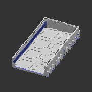
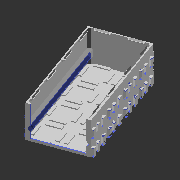
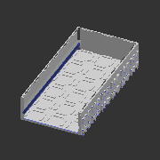
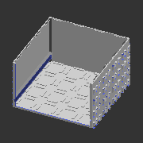

# A_W*
* System: A
* Path: `models/SYS_A/drawer_trays`
# Components
## A_W221
* Unit count: (WxLxH) 2 x 2 x 1
* Component size: (WxLxH) 50 x 50 x 15 mm

| **A_W221** | **A_W221L** | 
| --- | --- | 
|  | Without floor | 
|  |  | 

---
## A_W222
* Unit count: (WxLxH) 2 x 2 x 2
* Component size: (WxLxH) 50 x 50 x 30 mm

| **A_W222** | **A_W222L** | 
| --- | --- | 
|  | Without floor | 
| STL: [drawers](https://github.com/CZDanol/DNLTray/releases/latest/download/DNLTray_drawers.zip) | STL: [drawers](https://github.com/CZDanol/DNLTray/releases/latest/download/DNLTray_drawers.zip) | 
|  |  | 

---
## A_W241
* Unit count: (WxLxH) 2 x 4 x 1
* Component size: (WxLxH) 50 x 100 x 15 mm

| **A_W241** | **A_W241L** | 
| --- | --- | 
|  | Without floor | 
|  |  | 

---
## A_W242
* Unit count: (WxLxH) 2 x 4 x 2
* Component size: (WxLxH) 50 x 100 x 30 mm

| **A_W242** | **A_W242L** | 
| --- | --- | 
|  | Without floor | 
| STL: [drawers](https://github.com/CZDanol/DNLTray/releases/latest/download/DNLTray_drawers.zip) | STL: [drawers](https://github.com/CZDanol/DNLTray/releases/latest/download/DNLTray_drawers.zip) | 
|  |  | 

---
## A_W261
* Unit count: (WxLxH) 2 x 6 x 1
* Component size: (WxLxH) 50 x 150 x 15 mm

| **A_W261** | **A_W261L** | 
| --- | --- | 
|  | Without floor | 
|  |  | 

---
## A_W262
* Unit count: (WxLxH) 2 x 6 x 2
* Component size: (WxLxH) 50 x 150 x 30 mm

| **A_W262** | **A_W262L** | 
| --- | --- | 
|  | Without floor | 
|  |  | 

---
## A_W321
* Unit count: (WxLxH) 3 x 2 x 1
* Component size: (WxLxH) 75 x 50 x 15 mm

| **A_W321** | **A_W321L** | 
| --- | --- | 
|  | Without floor | 
|  |  | 

---
## A_W322
* Unit count: (WxLxH) 3 x 2 x 2
* Component size: (WxLxH) 75 x 50 x 30 mm

| **A_W322** | **A_W322L** | 
| --- | --- | 
|  | Without floor | 
|  |  | 

---
## A_W341
* Unit count: (WxLxH) 3 x 4 x 1
* Component size: (WxLxH) 75 x 100 x 15 mm

| **A_W341** | **A_W341L** | 
| --- | --- | 
|  | Without floor | 
|  |  | 

---
## A_W342
* Unit count: (WxLxH) 3 x 4 x 2
* Component size: (WxLxH) 75 x 100 x 30 mm

| **A_W342** | **A_W342L** | 
| --- | --- | 
|  | Without floor | 
| STL: [drawers](https://github.com/CZDanol/DNLTray/releases/latest/download/DNLTray_drawers.zip) | STL: [drawers](https://github.com/CZDanol/DNLTray/releases/latest/download/DNLTray_drawers.zip) | 
|  |  | 

---
## A_W361
* Unit count: (WxLxH) 3 x 6 x 1
* Component size: (WxLxH) 75 x 150 x 15 mm

| **A_W361** | **A_W361L** | 
| --- | --- | 
|  | Without floor | 
|  |  | 

---
## A_W362
* Unit count: (WxLxH) 3 x 6 x 2
* Component size: (WxLxH) 75 x 150 x 30 mm

| **A_W362** | **A_W362L** | 
| --- | --- | 
|  | Without floor | 
|  |  | 

---
## A_W421
* Unit count: (WxLxH) 4 x 2 x 1
* Component size: (WxLxH) 100 x 50 x 15 mm

| **A_W421** | **A_W421L** | 
| --- | --- | 
|  | Without floor | 
|  |  | 

---
## A_W422
* Unit count: (WxLxH) 4 x 2 x 2
* Component size: (WxLxH) 100 x 50 x 30 mm

| **A_W422** | **A_W422L** | 
| --- | --- | 
|  | Without floor | 
| STL: [drawers](https://github.com/CZDanol/DNLTray/releases/latest/download/DNLTray_drawers.zip) | STL: [drawers](https://github.com/CZDanol/DNLTray/releases/latest/download/DNLTray_drawers.zip) | 
|  |  | 

---
## A_W424
* Unit count: (WxLxH) 4 x 2 x 4
* Component size: (WxLxH) 100 x 50 x 60 mm

| **A_W424** | **A_W424L** | 
| --- | --- | 
|  | Without floor | 
|  |  | 

---
## A_W441
* Unit count: (WxLxH) 4 x 4 x 1
* Component size: (WxLxH) 100 x 100 x 15 mm

| **A_W441** | **A_W441L** | 
| --- | --- | 
|  | Without floor | 
|  |  | 

---
## A_W442
* Unit count: (WxLxH) 4 x 4 x 2
* Component size: (WxLxH) 100 x 100 x 30 mm

| **A_W442** | **A_W442L** | 
| --- | --- | 
|  | Without floor | 
|  |  | 

---
## A_W444
* Unit count: (WxLxH) 4 x 4 x 4
* Component size: (WxLxH) 100 x 100 x 60 mm

| **A_W444** | **A_W444L** | 
| --- | --- | 
|  | Without floor | 
| STL: [drawers](https://github.com/CZDanol/DNLTray/releases/latest/download/DNLTray_drawers.zip) | STL: [drawers](https://github.com/CZDanol/DNLTray/releases/latest/download/DNLTray_drawers.zip) | 
|  |  | 

---
## A_W461
* Unit count: (WxLxH) 4 x 6 x 1
* Component size: (WxLxH) 100 x 150 x 15 mm

| **A_W461** | **A_W461L** | 
| --- | --- | 
|  | Without floor | 
|  |  | 

---
## A_W462
* Unit count: (WxLxH) 4 x 6 x 2
* Component size: (WxLxH) 100 x 150 x 30 mm

| **A_W462** | **A_W462L** | 
| --- | --- | 
|  | Without floor | 
|  |  | 

---
## A_W464
* Unit count: (WxLxH) 4 x 6 x 4
* Component size: (WxLxH) 100 x 150 x 60 mm

| **A_W464** | **A_W464L** | 
| --- | --- | 
|  | Without floor | 
|  |  | 

---
