# A_T221*
* System: A
* Unit count: 2 x 2 x 1 units
* Component size: (WxHxL) 50 x 50 x 15 mm
* Path: `models/SYS_A/trays/2x2x1_units__50x50x15_mm`
# Components
## A_T221_1-2-1_1
| **A_T221F_1-2-1_1** | 
| --- | 
| STL: trays | 
| 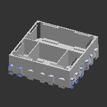 | 

---
## A_T221_1x1
| **A_T221F_1x1** | 
| --- | 
| STL: trays | 
| 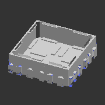 | 

---
## A_T221_2_dg
| **A_T221F_2_dg** | 
| --- | 
| STL: trays | 
| 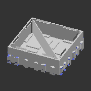 | 

---
## A_T221_2x1
| **A_T221F_2x1** | 
| --- | 
| STL: trays | 
| 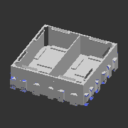 | 

---
## A_T221_2x1_1x1
| **A_T221F_2x1_1x1** | 
| --- | 
| STL: trays | 
| 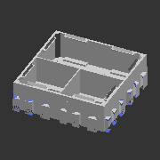 | 

---
## A_T221_2x1_1x1h2_2x1
| **A_T221F_2x1_1x1h2_2x1** | 
| --- | 
| STL: trays | 
| 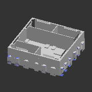 | 

---
## A_T221_2x2
| **A_T221F_2x2** | 
| --- | 
| STL: trays | 
| 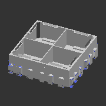 | 

---
## A_T221_2x2_2x1
| **A_T221F_2x2_2x1** | 
| --- | 
| STL: trays | 
| 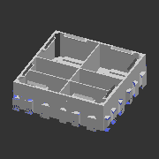 | 

---
## A_T221_3x1
| **A_T221F_3x1** | 
| --- | 
| STL: trays | 
| 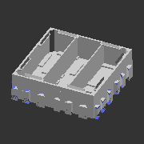 | 

---
## A_T221_3x1_1x1
| **A_T221F_3x1_1x1** | 
| --- | 
| STL: trays | 
|  | 

---
## A_T221_3x2
| **A_T221F_3x2** | 
| --- | 
| STL: trays | 
|  | 

---
## A_T221_3x3
| **A_T221F_3x3** | 
| --- | 
| STL: trays | 
| 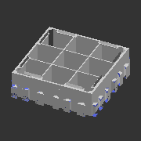 | 

---
## A_T221_4x1
| **A_T221F_4x1** | 
| --- | 
| STL: trays | 
| 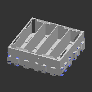 | 

---
## A_T221_4x1_1x1
| **A_T221F_4x1_1x1** | 
| --- | 
| STL: trays | 
| 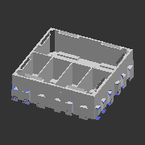 | 

---
## A_T221_4x2
| **A_T221F_4x2** | 
| --- | 
| STL: trays | 
| 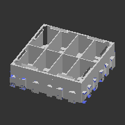 | 

---
## A_T221_4x2_1-2-1
| **A_T221F_4x2_1-2-1** | 
| --- | 
| STL: trays | 
| 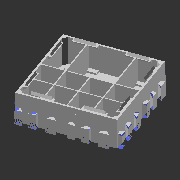 | 

---
## A_T221_4x2_2x1
| **A_T221F_4x2_2x1** | 
| --- | 
| STL: trays | 
| 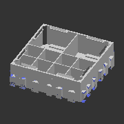 | 

---
## A_T221_4x2_4x1
| **A_T221F_4x2_4x1** | 
| --- | 
| STL: trays | 
| 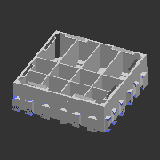 | 

---
## A_T221_4x4
| **A_T221F_4x4** | 
| --- | 
| STL: trays | 
| 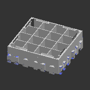 | 

---
## A_T221_8x1
| **A_T221F_8x1** | 
| --- | 
| STL: trays | 
|  | 

---
## A_T221_8x2
| **A_T221F_8x2** | 
| --- | 
| STL: trays | 
| 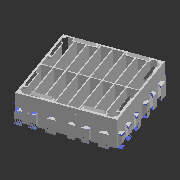 | 

---
## A_T221_8x3
| **A_T221F_8x3** | 
| --- | 
| STL: trays | 
| 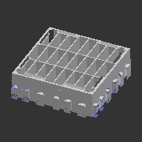 | 

---
## A_T221_8x4
| **A_T221F_8x4** | 
| --- | 
| STL: trays | 
| 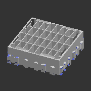 | 

---
## A_T221_8x8
| **A_T221F_8x8** | 
| --- | 
| STL: trays | 
| 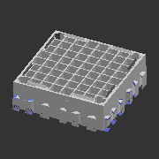 | 

---
## A_T221_sqc
| **A_T221F_sqc** | 
| --- | 
| STL: trays | 
| 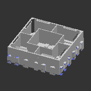 | 

---
## A_T221_sqc_alt
| **A_T221F_sqc_alt** | 
| --- | 
| STL: trays | 
| 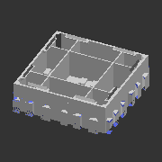 | 

---
## A_T221_sqc_dg
| **A_T221F_sqc_dg** | 
| --- | 
| STL: trays | 
| 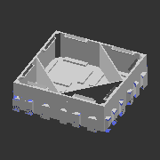 | 

---
## A_T221_tr4
| **A_T221F_tr4** | 
| --- | 
| STL: trays | 
| 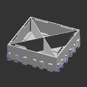 | 

---
