# A_T441*
* System: A
* Unit count: 4 x 4 x 1 units
* Component size: (WxHxL) 100 x 100 x 15 mm
* Path: `models/SYS_A/trays/4x4x1_units__100x100x15_mm`
# Components
## A_T441_1-2-1_1
| **A_T441F_1-2-1_1** | 
| --- | 
| STL: trays | 
| 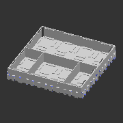 | 

---
## A_T441_1x1
| **A_T441F_1x1** | 
| --- | 
| STL: trays | 
| 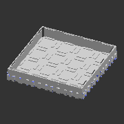 | 

---
## A_T441_2_dg
| **A_T441F_2_dg** | 
| --- | 
| STL: trays | 
| 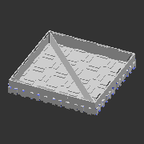 | 

---
## A_T441_2x1
| **A_T441F_2x1** | 
| --- | 
| STL: trays | 
| 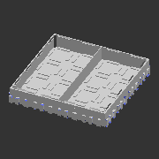 | 

---
## A_T441_2x1_1x1
| **A_T441F_2x1_1x1** | 
| --- | 
| STL: trays | 
| 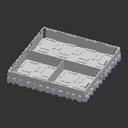 | 

---
## A_T441_2x1_1x1h2_2x1
| **A_T441F_2x1_1x1h2_2x1** | 
| --- | 
| STL: trays | 
| 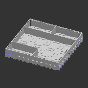 | 

---
## A_T441_2x2
| **A_T441F_2x2** | 
| --- | 
| STL: trays | 
| 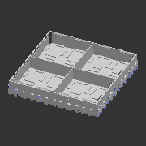 | 

---
## A_T441_2x2_2x1
| **A_T441F_2x2_2x1** | 
| --- | 
| STL: trays | 
| 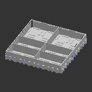 | 

---
## A_T441_3x1
| **A_T441F_3x1** | 
| --- | 
| STL: trays | 
| 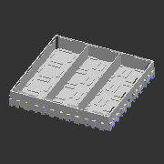 | 

---
## A_T441_3x1_1x1
| **A_T441F_3x1_1x1** | 
| --- | 
| STL: trays | 
| 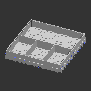 | 

---
## A_T441_3x2
| **A_T441F_3x2** | 
| --- | 
| STL: trays | 
| 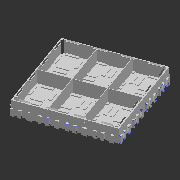 | 

---
## A_T441_3x3
| **A_T441F_3x3** | 
| --- | 
| STL: trays | 
| 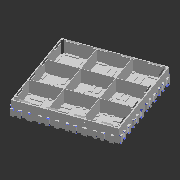 | 

---
## A_T441_4x1
| **A_T441F_4x1** | 
| --- | 
| STL: trays | 
| 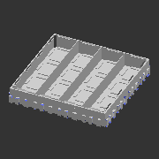 | 

---
## A_T441_4x1_1x1
| **A_T441F_4x1_1x1** | 
| --- | 
| STL: trays | 
| 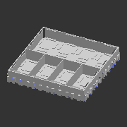 | 

---
## A_T441_4x2
| **A_T441F_4x2** | 
| --- | 
| STL: trays | 
|  | 

---
## A_T441_4x2_1-2-1
| **A_T441F_4x2_1-2-1** | 
| --- | 
| STL: trays | 
| 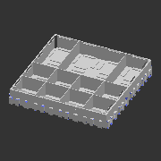 | 

---
## A_T441_4x2_2x1
| **A_T441F_4x2_2x1** | 
| --- | 
| STL: trays | 
|  | 

---
## A_T441_4x2_4x1
| **A_T441F_4x2_4x1** | 
| --- | 
| STL: trays | 
| 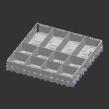 | 

---
## A_T441_4x4
| **A_T441F_4x4** | 
| --- | 
| STL: trays | 
| 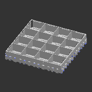 | 

---
## A_T441_8x1
| **A_T441F_8x1** | 
| --- | 
| STL: trays | 
| 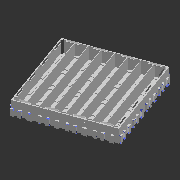 | 

---
## A_T441_8x2
| **A_T441F_8x2** | 
| --- | 
| STL: trays | 
| 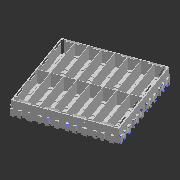 | 

---
## A_T441_8x3
| **A_T441F_8x3** | 
| --- | 
| STL: trays | 
| 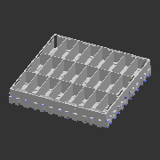 | 

---
## A_T441_8x4
| **A_T441F_8x4** | 
| --- | 
| STL: trays | 
| 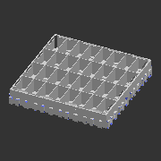 | 

---
## A_T441_8x8
| **A_T441F_8x8** | 
| --- | 
| STL: trays | 
| 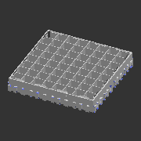 | 

---
## A_T441_sqc
| **A_T441F_sqc** | 
| --- | 
| STL: trays | 
| 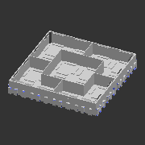 | 

---
## A_T441_sqc_alt
| **A_T441F_sqc_alt** | 
| --- | 
| STL: trays | 
| 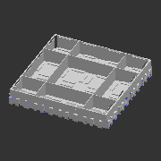 | 

---
## A_T441_sqc_dg
| **A_T441F_sqc_dg** | 
| --- | 
| STL: trays | 
| 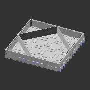 | 

---
## A_T441_tr4
| **A_T441F_tr4** | 
| --- | 
| STL: trays | 
| 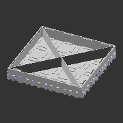 | 

---
