# A_T626*
* System: A
* Unit count: 6 x 2 x 6 units
* Component size: (WxHxL) 150 x 50 x 90 mm
* Path: `models/SYS_A/trays/6x2x6_units__150x50x90_mm`
# Components
## A_T626_1-2-1_1
| **A_T626F_1-2-1_1** | **A_T626F_1-2-1_1R** | 
| --- | --- | 
|  | Rotated pattern | 
| STL: trays | STL: trays | 
|  |  | 

---
## A_T626_1x1
| **A_T626F_1x1** | 
| --- | 
| STL: trays | 
| 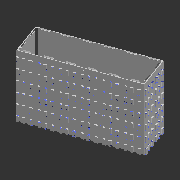 | 

---
## A_T626_2_dg
| **A_T626F_2_dg** | **A_T626F_2_dgR** | 
| --- | --- | 
|  | Rotated pattern | 
| STL: trays | STL: trays | 
|  | 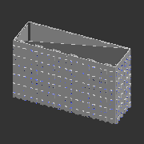 | 

---
## A_T626_2x1
| **A_T626F_2x1** | **A_T626F_2x1R** | 
| --- | --- | 
|  | Rotated pattern | 
| STL: trays | STL: trays | 
| 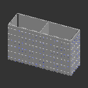 | 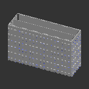 | 

---
## A_T626_2x1_1x1
| **A_T626F_2x1_1x1** | **A_T626F_2x1_1x1R** | 
| --- | --- | 
|  | Rotated pattern | 
| STL: trays | STL: trays | 
|  |  | 

---
## A_T626_2x1_1x1h2_2x1
| **A_T626F_2x1_1x1h2_2x1** | **A_T626F_2x1_1x1h2_2x1R** | 
| --- | --- | 
|  | Rotated pattern | 
| STL: trays | STL: trays | 
| 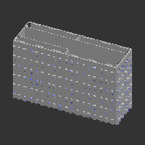 | 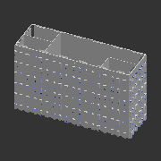 | 

---
## A_T626_2x2
| **A_T626F_2x2** | 
| --- | 
| STL: trays | 
| 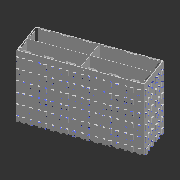 | 

---
## A_T626_2x2_2x1
| **A_T626F_2x2_2x1** | **A_T626F_2x2_2x1R** | 
| --- | --- | 
|  | Rotated pattern | 
| STL: trays | STL: trays | 
|  | 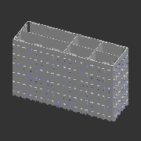 | 

---
## A_T626_3x1
| **A_T626F_3x1** | **A_T626F_3x1R** | 
| --- | --- | 
|  | Rotated pattern | 
| STL: trays | STL: trays | 
| 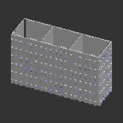 | 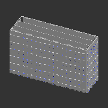 | 

---
## A_T626_3x1_1x1
| **A_T626F_3x1_1x1** | **A_T626F_3x1_1x1R** | 
| --- | --- | 
|  | Rotated pattern | 
| STL: trays | STL: trays | 
|  | 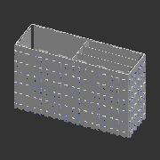 | 

---
## A_T626_3x2
| **A_T626F_3x2** | **A_T626F_3x2R** | 
| --- | --- | 
|  | Rotated pattern | 
| STL: trays | STL: trays | 
| 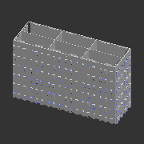 | 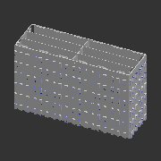 | 

---
## A_T626_3x3
| **A_T626F_3x3** | 
| --- | 
| STL: trays | 
| 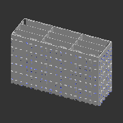 | 

---
## A_T626_4x1
| **A_T626F_4x1** | **A_T626F_4x1R** | 
| --- | --- | 
|  | Rotated pattern | 
| STL: trays | STL: trays | 
| 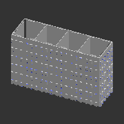 |  | 

---
## A_T626_4x1_1x1
| **A_T626F_4x1_1x1** | **A_T626F_4x1_1x1R** | 
| --- | --- | 
|  | Rotated pattern | 
| STL: trays | STL: trays | 
|  | 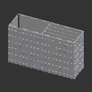 | 

---
## A_T626_4x2
| **A_T626F_4x2** | **A_T626F_4x2R** | 
| --- | --- | 
|  | Rotated pattern | 
| STL: trays | STL: trays | 
| 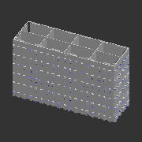 | 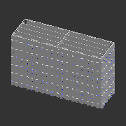 | 

---
## A_T626_4x2_1-2-1
| **A_T626F_4x2_1-2-1** | **A_T626F_4x2_1-2-1R** | 
| --- | --- | 
|  | Rotated pattern | 
| STL: trays | STL: trays | 
| 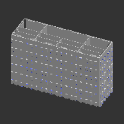 |  | 

---
## A_T626_4x2_2x1
| **A_T626F_4x2_2x1** | **A_T626F_4x2_2x1R** | 
| --- | --- | 
|  | Rotated pattern | 
| STL: trays | STL: trays | 
| 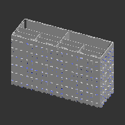 |  | 

---
## A_T626_4x2_4x1
| **A_T626F_4x2_4x1** | **A_T626F_4x2_4x1R** | 
| --- | --- | 
|  | Rotated pattern | 
| STL: trays | STL: trays | 
| 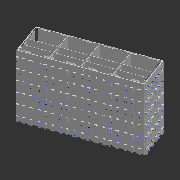 |  | 

---
## A_T626_4x4
| **A_T626F_4x4** | 
| --- | 
| STL: trays | 
| 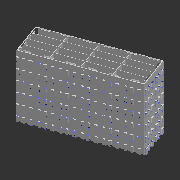 | 

---
## A_T626_8x1
| **A_T626F_8x1** | **A_T626F_8x1R** | 
| --- | --- | 
|  | Rotated pattern | 
| STL: trays | STL: trays | 
| 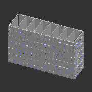 | 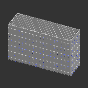 | 

---
## A_T626_8x2
| **A_T626F_8x2** | **A_T626F_8x2R** | 
| --- | --- | 
|  | Rotated pattern | 
| STL: trays | STL: trays | 
|  | 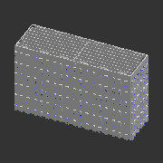 | 

---
## A_T626_8x3
| **A_T626F_8x3** | **A_T626F_8x3R** | 
| --- | --- | 
|  | Rotated pattern | 
| STL: trays | STL: trays | 
| 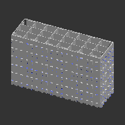 | 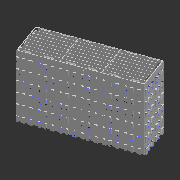 | 

---
## A_T626_8x4
| **A_T626F_8x4** | **A_T626F_8x4R** | 
| --- | --- | 
|  | Rotated pattern | 
| STL: trays | STL: trays | 
|  |  | 

---
## A_T626_8x8
| **A_T626F_8x8** | 
| --- | 
| STL: trays | 
| 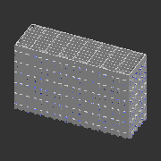 | 

---
## A_T626_sqc
| **A_T626F_sqc** | 
| --- | 
| STL: trays | 
| 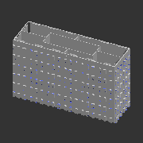 | 

---
## A_T626_sqc_alt
| **A_T626F_sqc_alt** | 
| --- | 
| STL: trays | 
|  | 

---
## A_T626_sqc_dg
| **A_T626F_sqc_dg** | 
| --- | 
| STL: trays | 
| 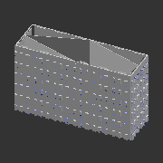 | 

---
## A_T626_tr4
| **A_T626F_tr4** | 
| --- | 
| STL: trays | 
| 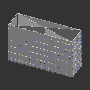 | 

---
