# A_T661*
* System: A
* Unit count: 6 x 6 x 1 units
* Component size: (WxHxL) 150 x 150 x 15 mm
* Path: `models/SYS_A/trays/6x6x1_units__150x150x15_mm`
# Components
## A_T661_1-2-1_1
| **A_T661F_1-2-1_1** | 
| --- | 
| STL: [trays](https://github.com/CZDanol/DNLTray/releases/latest/download/DNLTray_trays.zip) | 
| 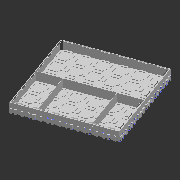 | 

---
## A_T661_1x1
| **A_T661F_1x1** | 
| --- | 
| STL: [trays](https://github.com/CZDanol/DNLTray/releases/latest/download/DNLTray_trays.zip) | 
| 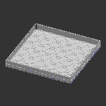 | 

---
## A_T661_2_dg
| **A_T661F_2_dg** | 
| --- | 
| STL: [trays](https://github.com/CZDanol/DNLTray/releases/latest/download/DNLTray_trays.zip) | 
| 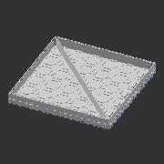 | 

---
## A_T661_2x1
| **A_T661F_2x1** | 
| --- | 
| STL: [trays](https://github.com/CZDanol/DNLTray/releases/latest/download/DNLTray_trays.zip) | 
| 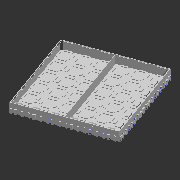 | 

---
## A_T661_2x1_1x1
| **A_T661F_2x1_1x1** | 
| --- | 
| STL: [trays](https://github.com/CZDanol/DNLTray/releases/latest/download/DNLTray_trays.zip) | 
| 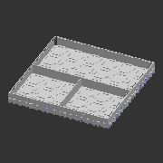 | 

---
## A_T661_2x1_1x1h2_2x1
| **A_T661F_2x1_1x1h2_2x1** | 
| --- | 
| STL: [trays](https://github.com/CZDanol/DNLTray/releases/latest/download/DNLTray_trays.zip) | 
| 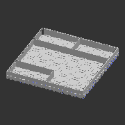 | 

---
## A_T661_2x2
| **A_T661F_2x2** | 
| --- | 
| STL: [trays](https://github.com/CZDanol/DNLTray/releases/latest/download/DNLTray_trays.zip) | 
| 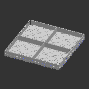 | 

---
## A_T661_2x2_2x1
| **A_T661F_2x2_2x1** | 
| --- | 
| STL: [trays](https://github.com/CZDanol/DNLTray/releases/latest/download/DNLTray_trays.zip) | 
| 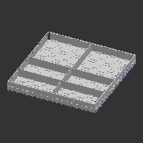 | 

---
## A_T661_3x1
| **A_T661F_3x1** | 
| --- | 
| STL: [trays](https://github.com/CZDanol/DNLTray/releases/latest/download/DNLTray_trays.zip) | 
|  | 

---
## A_T661_3x1_1x1
| **A_T661F_3x1_1x1** | 
| --- | 
| STL: [trays](https://github.com/CZDanol/DNLTray/releases/latest/download/DNLTray_trays.zip) | 
| 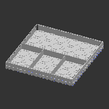 | 

---
## A_T661_3x2
| **A_T661F_3x2** | 
| --- | 
| STL: [trays](https://github.com/CZDanol/DNLTray/releases/latest/download/DNLTray_trays.zip) | 
| 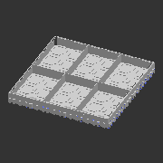 | 

---
## A_T661_3x3
| **A_T661F_3x3** | 
| --- | 
| STL: [trays](https://github.com/CZDanol/DNLTray/releases/latest/download/DNLTray_trays.zip) | 
| 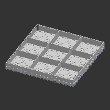 | 

---
## A_T661_4x1
| **A_T661F_4x1** | 
| --- | 
| STL: [trays](https://github.com/CZDanol/DNLTray/releases/latest/download/DNLTray_trays.zip) | 
| 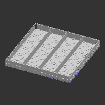 | 

---
## A_T661_4x1_1x1
| **A_T661F_4x1_1x1** | 
| --- | 
| STL: [trays](https://github.com/CZDanol/DNLTray/releases/latest/download/DNLTray_trays.zip) | 
| 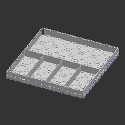 | 

---
## A_T661_4x2
| **A_T661F_4x2** | 
| --- | 
| STL: [trays](https://github.com/CZDanol/DNLTray/releases/latest/download/DNLTray_trays.zip) | 
|  | 

---
## A_T661_4x2_1-2-1
| **A_T661F_4x2_1-2-1** | 
| --- | 
| STL: [trays](https://github.com/CZDanol/DNLTray/releases/latest/download/DNLTray_trays.zip) | 
| 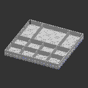 | 

---
## A_T661_4x2_2x1
| **A_T661F_4x2_2x1** | 
| --- | 
| STL: [trays](https://github.com/CZDanol/DNLTray/releases/latest/download/DNLTray_trays.zip) | 
| 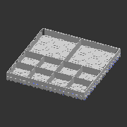 | 

---
## A_T661_4x2_4x1
| **A_T661F_4x2_4x1** | 
| --- | 
| STL: [trays](https://github.com/CZDanol/DNLTray/releases/latest/download/DNLTray_trays.zip) | 
| 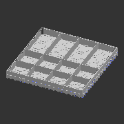 | 

---
## A_T661_4x4
| **A_T661F_4x4** | 
| --- | 
| STL: [trays](https://github.com/CZDanol/DNLTray/releases/latest/download/DNLTray_trays.zip) | 
|  | 

---
## A_T661_8x1
| **A_T661F_8x1** | 
| --- | 
| STL: [trays](https://github.com/CZDanol/DNLTray/releases/latest/download/DNLTray_trays.zip) | 
| 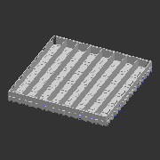 | 

---
## A_T661_8x2
| **A_T661F_8x2** | 
| --- | 
| STL: [trays](https://github.com/CZDanol/DNLTray/releases/latest/download/DNLTray_trays.zip) | 
| 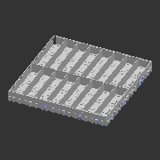 | 

---
## A_T661_8x3
| **A_T661F_8x3** | 
| --- | 
| STL: [trays](https://github.com/CZDanol/DNLTray/releases/latest/download/DNLTray_trays.zip) | 
| 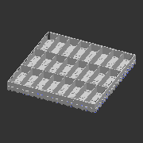 | 

---
## A_T661_8x4
| **A_T661F_8x4** | 
| --- | 
| STL: [trays](https://github.com/CZDanol/DNLTray/releases/latest/download/DNLTray_trays.zip) | 
|  | 

---
## A_T661_8x8
| **A_T661F_8x8** | 
| --- | 
| STL: [trays](https://github.com/CZDanol/DNLTray/releases/latest/download/DNLTray_trays.zip) | 
| 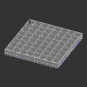 | 

---
## A_T661_sqc
| **A_T661F_sqc** | 
| --- | 
| STL: [trays](https://github.com/CZDanol/DNLTray/releases/latest/download/DNLTray_trays.zip) | 
| 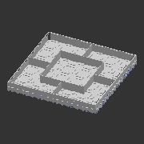 | 

---
## A_T661_sqc_alt
| **A_T661F_sqc_alt** | 
| --- | 
| STL: [trays](https://github.com/CZDanol/DNLTray/releases/latest/download/DNLTray_trays.zip) | 
| 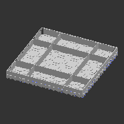 | 

---
## A_T661_sqc_dg
| **A_T661F_sqc_dg** | 
| --- | 
| STL: [trays](https://github.com/CZDanol/DNLTray/releases/latest/download/DNLTray_trays.zip) | 
| 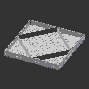 | 

---
## A_T661_tr4
| **A_T661F_tr4** | 
| --- | 
| STL: [trays](https://github.com/CZDanol/DNLTray/releases/latest/download/DNLTray_trays.zip) | 
| 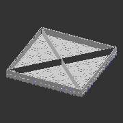 | 

---
