# A_T862*
* System: A
* Unit count: (WxLxH) 8 x 6 x 2
* Component size: (WxLxH) 200 x 150 x 30 mm
* Path: `models/SYS_A/trays/size_8x6x2`
# Components
## A_T862*_1-2-1_1*
| **A_T862F_1-2-1_1** | **A_T862F_1-2-1_1_R** | **A_T862H_1-2-1_1** | **A_T862H_1-2-1_1_R** | 
| --- | --- | --- | --- | 
| Full height | Full height | Half height | Half height | 
|  | Rotated pattern |  | Rotated pattern | 
| 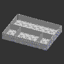 | 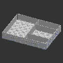 | 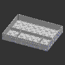 | 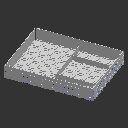 | 

---
## A_T862*_1-2-1_dg*
| **A_T862F_1-2-1_dg** | **A_T862F_1-2-1_dg_R** | **A_T862H_1-2-1_dg** | **A_T862H_1-2-1_dg_R** | 
| --- | --- | --- | --- | 
| Full height | Full height | Half height | Half height | 
|  | Rotated pattern |  | Rotated pattern | 
| 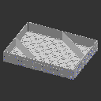 | 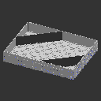 | 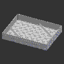 | 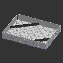 | 

---
## A_T862*_1x1*
| **A_T862F_1x1** | **A_T862H_1x1** | 
| --- | --- | 
| Full height | Half height | 
| 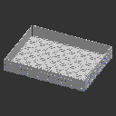 |  | 

---
## A_T862*_2_dg*
| **A_T862F_2_dg** | **A_T862F_2_dg_R** | **A_T862H_2_dg** | **A_T862H_2_dg_R** | 
| --- | --- | --- | --- | 
| Full height | Full height | Half height | Half height | 
|  | Rotated pattern |  | Rotated pattern | 
| 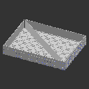 | 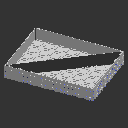 | 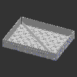 | 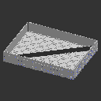 | 

---
## A_T862*_2x1*
| **A_T862F_2x1** | **A_T862F_2x1_R** | **A_T862H_2x1** | **A_T862H_2x1_R** | 
| --- | --- | --- | --- | 
| Full height | Full height | Half height | Half height | 
|  | Rotated pattern |  | Rotated pattern | 
| 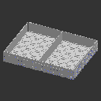 | 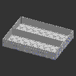 | 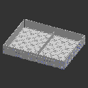 |  | 

---
## A_T862*_2x1_1x1*
| **A_T862F_2x1_1x1** | **A_T862F_2x1_1x1_R** | **A_T862H_2x1_1x1** | **A_T862H_2x1_1x1_R** | 
| --- | --- | --- | --- | 
| Full height | Full height | Half height | Half height | 
|  | Rotated pattern |  | Rotated pattern | 
| 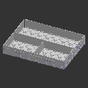 | 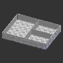 | 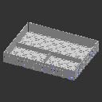 | 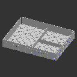 | 

---
## A_T862*_2x1_1x1h2_2x1*
| **A_T862F_2x1_1x1h2_2x1** | **A_T862F_2x1_1x1h2_2x1_R** | **A_T862H_2x1_1x1h2_2x1** | **A_T862H_2x1_1x1h2_2x1_R** | 
| --- | --- | --- | --- | 
| Full height | Full height | Half height | Half height | 
|  | Rotated pattern |  | Rotated pattern | 
| 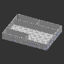 | 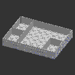 | 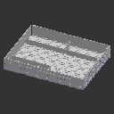 | 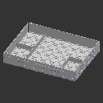 | 

---
## A_T862*_2x2*
| **A_T862F_2x2** | **A_T862H_2x2** | 
| --- | --- | 
| Full height | Half height | 
|  | 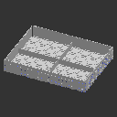 | 

---
## A_T862*_2x2_2x1*
| **A_T862F_2x2_2x1** | **A_T862F_2x2_2x1_R** | **A_T862H_2x2_2x1** | **A_T862H_2x2_2x1_R** | 
| --- | --- | --- | --- | 
| Full height | Full height | Half height | Half height | 
|  | Rotated pattern |  | Rotated pattern | 
| 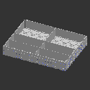 | 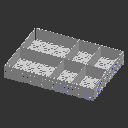 | 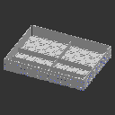 | 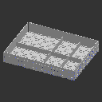 | 

---
## A_T862*_2x2_c*
| **A_T862F_2x2_c** | **A_T862H_2x2_c** | 
| --- | --- | 
| Full height | Half height | 
| 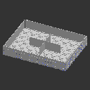 | 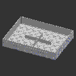 | 

---
## A_T862*_3_dg*
| **A_T862F_3_dg** | **A_T862F_3_dg_R** | **A_T862H_3_dg** | **A_T862H_3_dg_R** | 
| --- | --- | --- | --- | 
| Full height | Full height | Half height | Half height | 
|  | Rotated pattern |  | Rotated pattern | 
| 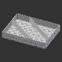 | 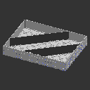 | 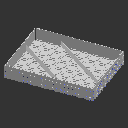 | 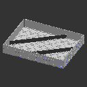 | 

---
## A_T862*_3x1*
| **A_T862F_3x1** | **A_T862F_3x1_R** | **A_T862H_3x1** | **A_T862H_3x1_R** | 
| --- | --- | --- | --- | 
| Full height | Full height | Half height | Half height | 
|  | Rotated pattern |  | Rotated pattern | 
| 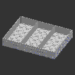 | 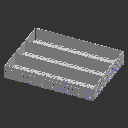 | 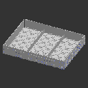 | 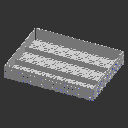 | 

---
## A_T862*_3x1_1x1*
| **A_T862F_3x1_1x1** | **A_T862F_3x1_1x1_R** | **A_T862H_3x1_1x1** | **A_T862H_3x1_1x1_R** | 
| --- | --- | --- | --- | 
| Full height | Full height | Half height | Half height | 
|  | Rotated pattern |  | Rotated pattern | 
| 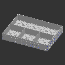 | 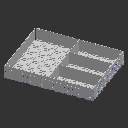 | 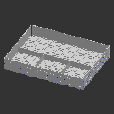 | 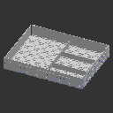 | 

---
## A_T862*_3x2*
| **A_T862F_3x2** | **A_T862F_3x2_R** | **A_T862H_3x2** | **A_T862H_3x2_R** | 
| --- | --- | --- | --- | 
| Full height | Full height | Half height | Half height | 
|  | Rotated pattern |  | Rotated pattern | 
|  |  | 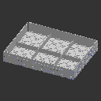 | 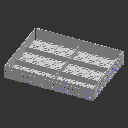 | 

---
## A_T862*_3x3*
| **A_T862F_3x3** | **A_T862H_3x3** | 
| --- | --- | 
| Full height | Half height | 
| 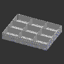 | 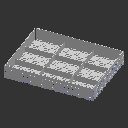 | 

---
## A_T862*_4x1*
| **A_T862F_4x1** | **A_T862F_4x1_R** | **A_T862H_4x1** | **A_T862H_4x1_R** | 
| --- | --- | --- | --- | 
| Full height | Full height | Half height | Half height | 
|  | Rotated pattern |  | Rotated pattern | 
| 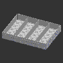 | 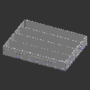 | 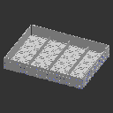 |  | 

---
## A_T862*_4x1_1x1*
| **A_T862F_4x1_1x1** | **A_T862F_4x1_1x1_R** | **A_T862H_4x1_1x1** | **A_T862H_4x1_1x1_R** | 
| --- | --- | --- | --- | 
| Full height | Full height | Half height | Half height | 
|  | Rotated pattern |  | Rotated pattern | 
|  |  |  |  | 

---
## A_T862*_4x1_nc*
| **A_T862F_4x1_nc** | **A_T862F_4x1_nc_R** | **A_T862H_4x1_nc** | **A_T862H_4x1_nc_R** | 
| --- | --- | --- | --- | 
| Full height | Full height | Half height | Half height | 
|  | Rotated pattern |  | Rotated pattern | 
|  |  |  |  | 

---
## A_T862*_4x2*
| **A_T862F_4x2** | **A_T862F_4x2_R** | **A_T862H_4x2** | **A_T862H_4x2_R** | 
| --- | --- | --- | --- | 
| Full height | Full height | Half height | Half height | 
|  | Rotated pattern |  | Rotated pattern | 
|  |  |  |  | 

---
## A_T862*_4x2_1-2-1*
| **A_T862F_4x2_1-2-1** | **A_T862F_4x2_1-2-1_R** | **A_T862H_4x2_1-2-1** | **A_T862H_4x2_1-2-1_R** | 
| --- | --- | --- | --- | 
| Full height | Full height | Half height | Half height | 
|  | Rotated pattern |  | Rotated pattern | 
|  |  |  |  | 

---
## A_T862*_4x2_2x1*
| **A_T862F_4x2_2x1** | **A_T862F_4x2_2x1_R** | **A_T862H_4x2_2x1** | **A_T862H_4x2_2x1_R** | 
| --- | --- | --- | --- | 
| Full height | Full height | Half height | Half height | 
|  | Rotated pattern |  | Rotated pattern | 
|  |  |  |  | 

---
## A_T862*_4x2_4x1*
| **A_T862F_4x2_4x1** | **A_T862F_4x2_4x1_R** | **A_T862H_4x2_4x1** | **A_T862H_4x2_4x1_R** | 
| --- | --- | --- | --- | 
| Full height | Full height | Half height | Half height | 
|  | Rotated pattern |  | Rotated pattern | 
|  |  |  |  | 

---
## A_T862*_4x4*
| **A_T862F_4x4** | **A_T862H_4x4** | 
| --- | --- | 
| Full height | Half height | 
|  |  | 

---
## A_T862*_6x1_nc*
| **A_T862F_6x1_nc** | **A_T862F_6x1_nc_R** | **A_T862H_6x1_nc** | **A_T862H_6x1_nc_R** | 
| --- | --- | --- | --- | 
| Full height | Full height | Half height | Half height | 
|  | Rotated pattern |  | Rotated pattern | 
|  |  |  |  | 

---
## A_T862*_8x1*
| **A_T862F_8x1** | **A_T862F_8x1_R** | **A_T862H_8x1** | **A_T862H_8x1_R** | 
| --- | --- | --- | --- | 
| Full height | Full height | Half height | Half height | 
|  | Rotated pattern |  | Rotated pattern | 
|  |  |  |  | 

---
## A_T862*_8x1_nc*
| **A_T862F_8x1_nc** | **A_T862F_8x1_nc_R** | **A_T862H_8x1_nc** | **A_T862H_8x1_nc_R** | 
| --- | --- | --- | --- | 
| Full height | Full height | Half height | Half height | 
|  | Rotated pattern |  | Rotated pattern | 
|  |  |  |  | 

---
## A_T862*_8x2*
| **A_T862F_8x2** | **A_T862F_8x2_R** | **A_T862H_8x2** | **A_T862H_8x2_R** | 
| --- | --- | --- | --- | 
| Full height | Full height | Half height | Half height | 
|  | Rotated pattern |  | Rotated pattern | 
|  |  |  |  | 

---
## A_T862*_8x3*
| **A_T862F_8x3** | **A_T862F_8x3_R** | **A_T862H_8x3** | **A_T862H_8x3_R** | 
| --- | --- | --- | --- | 
| Full height | Full height | Half height | Half height | 
|  | Rotated pattern |  | Rotated pattern | 
|  |  |  |  | 

---
## A_T862*_8x4*
| **A_T862F_8x4** | **A_T862F_8x4_R** | **A_T862H_8x4** | **A_T862H_8x4_R** | 
| --- | --- | --- | --- | 
| Full height | Full height | Half height | Half height | 
|  | Rotated pattern |  | Rotated pattern | 
|  |  |  |  | 

---
## A_T862*_8x8*
| **A_T862F_8x8** | **A_T862H_8x8** | 
| --- | --- | 
| Full height | Half height | 
|  |  | 

---
## A_T862*_sqc*
| **A_T862F_sqc** | **A_T862H_sqc** | 
| --- | --- | 
| Full height | Half height | 
|  |  | 

---
## A_T862*_sqc_alt*
| **A_T862F_sqc_alt** | **A_T862H_sqc_alt** | 
| --- | --- | 
| Full height | Half height | 
|  |  | 

---
## A_T862*_sqc_dg*
| **A_T862F_sqc_dg** | **A_T862H_sqc_dg** | 
| --- | --- | 
| Full height | Half height | 
|  |  | 

---
## A_T862*_tr4*
| **A_T862F_tr4** | **A_T862H_tr4** | 
| --- | --- | 
| Full height | Half height | 
|  |  | 

---
## A_T862*_tr8*
| **A_T862F_tr8** | **A_T862H_tr8** | 
| --- | --- | 
| Full height | Half height | 
|  |  | 

---
## A_T862*_tr8_alt*
| **A_T862F_tr8_alt** | **A_T862H_tr8_alt** | 
| --- | --- | 
| Full height | Half height | 
|  |  | 

---
